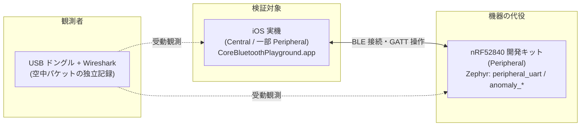
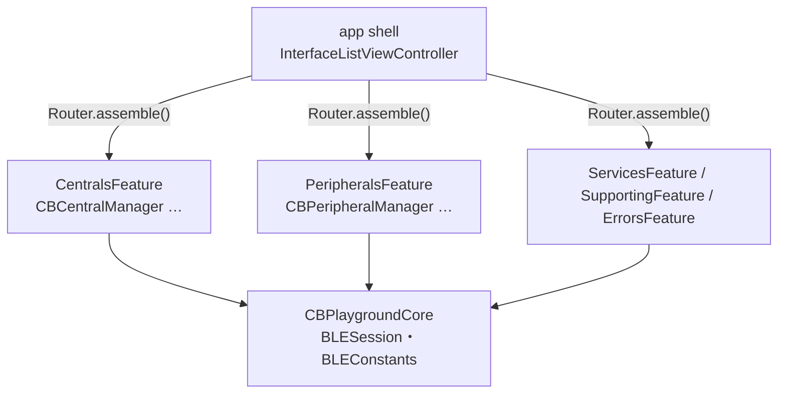
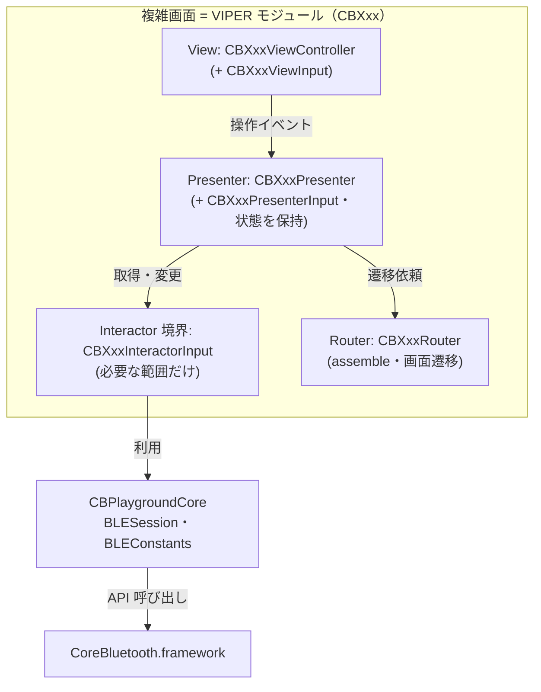
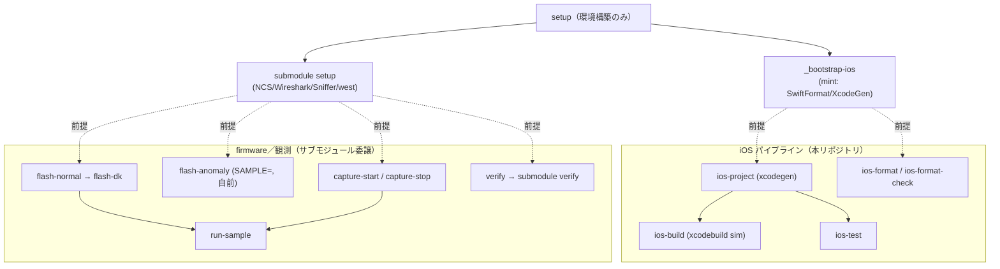
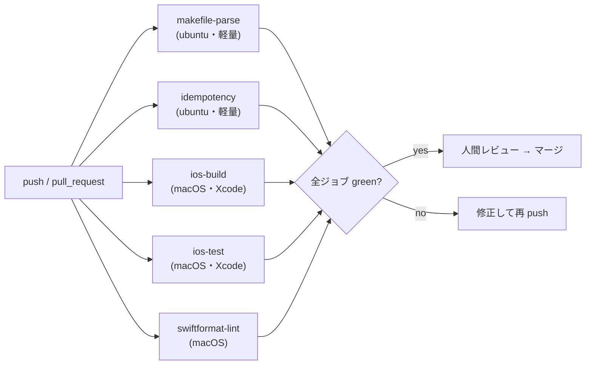
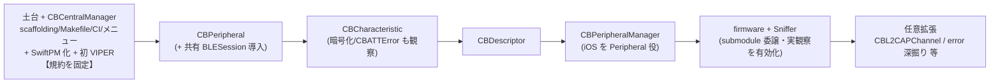
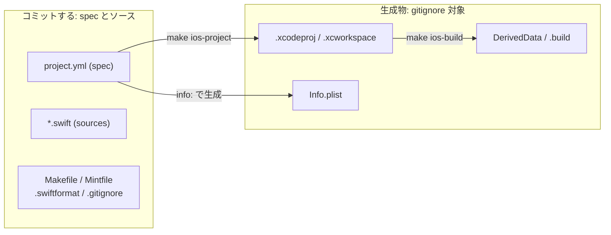
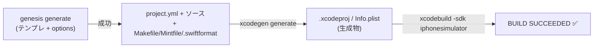
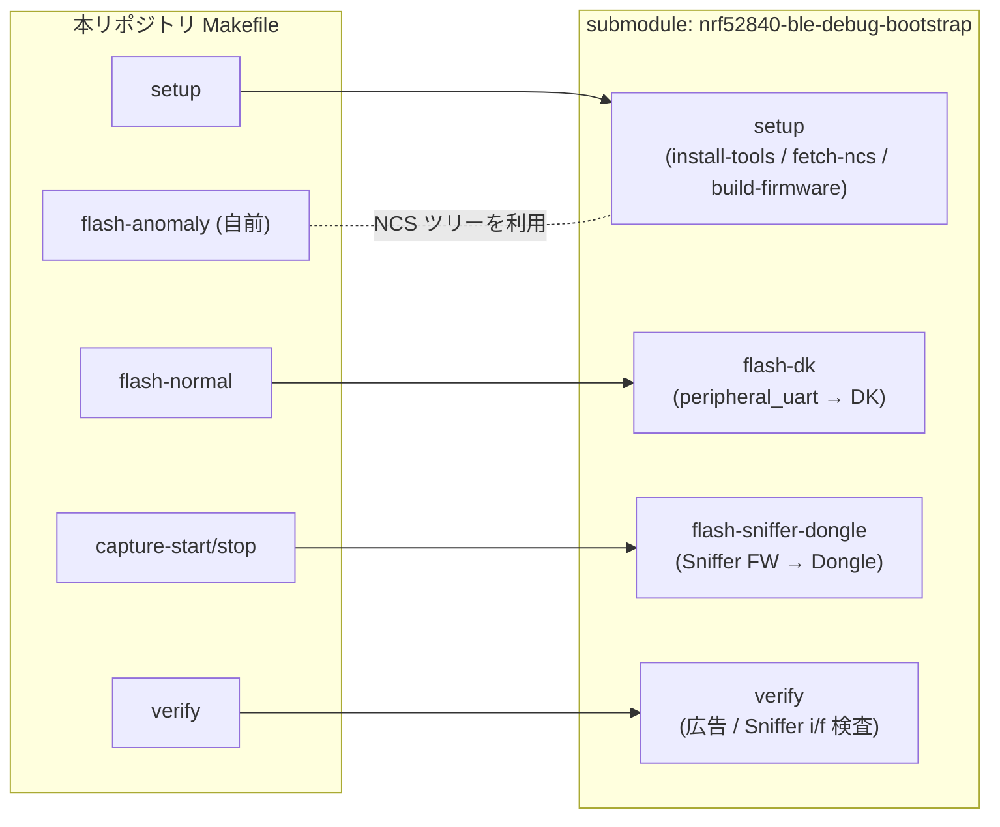
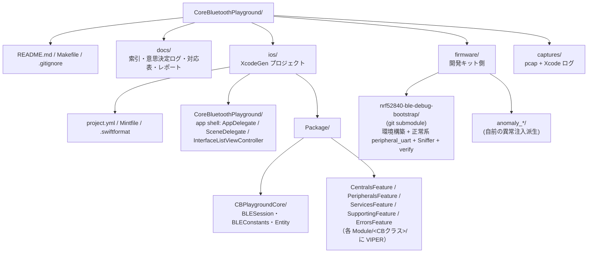

# 実装計画書 — Core Bluetooth サンプルコード集リポジトリ

**対象設計書:** DESIGN-002（サンプルコード集リポジトリ設計書）
**日付:** 2026-06-02
**前提:** 単一アプリにインターフェース一覧メニュー。View はインターフェース単位、実装は共通。UIKit でテンプレートを踏襲。1 インターフェースずつ増分で全 Core Bluetooth インターフェースを網羅する。

---

## 目次

| 章 | 題 |
| --- | --- |
| 1 | 背景と目的 |
| 2 | iOS サンプルアプリの構造 |
| 3 | Makefile の設計（コマンド面の確定） |
| 4 | GitHub Actions の設計（機械ゲート） |
| 5 | フェーズ分割 |
| 6 | 規約 |
| 7 | 検証方法 |
| 8 | 開発ループとエスカレーション |
| 付録 A | インターフェース先行の方針（設計判断ノート） |
| 付録 B | 目標規定文（実装計画メモ） |
| 付録 C | コミット方針（spec + ソースのみ。生成物は持たない） |
| 付録 D | テンプレートの扱い（フィージビリティ実測済み） |
| 付録 E | firmware 環境（サブモジュール委譲） |
| 付録 F | リポジトリ構造 |
| 付録 G | VIPER + SwiftPM の参照（RoofWallPainterEdit） |

---

## 1. 背景と目的

本リポジトリの目的は、Core Bluetooth の挙動をインターフェース単位で確認することにある。Core Bluetooth はプロプライエタリで内部実装が見えない。CBCentralManager・CBPeripheral・CBCharacteristic といった各クラスが実際にどう振る舞うかは、外から経験的に観察するほかない。そこでサンプルの分割単位を公式クラスに対応づける。あるクラスの挙動を見たいとき、対応するサンプルが一意に定まる。

観察は三者で成立する。Central 役を iOS 実機が担い、これが本来確認したいアプリ側の挙動である。Peripheral 役を nRF52840 開発キットが担い、正常系と異常系を切り替えて機器側を完全に制御する。USB ドングルと Wireshark が空中のパケットを独立に記録し、客観的証拠を残す。三者の関係を次に示す。



開発キットとファームウェアは観測対象であり実装の中心ではない。本計画の主成果物は **iOS サンプルアプリ**と、検証手順を自動化する **Makefile** である。

---

## 2. iOS サンプルアプリの構造

本リポジトリは、アプリ本体（app shell）と機能別 SwiftPM パッケージの組み合わせで構成する。app shell はインターフェース一覧メニュー（`InterfaceListViewController`）と起動処理だけを持ち、各機能パッケージへ依存する。パッケージは Apple ドキュメントのカテゴリ単位（Centrals / Peripherals / Services / Supporting / Errors）に切り、加えてスキャン→接続→探索の土台と `BLEConstants` を持つ共有コアパッケージ `CBPlaygroundCore` を置く。署名とビルドは app shell で一度に済み、実機で即座に試せる。

各サンプルは Core Bluetooth の 1 クラスにフォーカスする。**複雑な操作画面（状態遷移や画面遷移が多いもの）は VIPER（View / Presenter / Interactor / Router）で組み、単純な操作画面や「説明に留める」画面は軽量（プレーンな ViewController）にする**。VIPER と SwiftPM の流儀は `koki-mobile-studio/RoofWallPainter` の `Package/RoofWallPainterEdit` を範とする（付録 G）。クラスを単独実行できない事情（接続・探索が前提）は 1 章のとおりで、土台は `CBPlaygroundCore` の `BLESession` に集約し、各画面の Interactor がそこから必要な範囲だけを公開し、Presenter が表示用に取り出す。

app shell から各機能パッケージへの導線を次に示す。メニューの各行は、対応するモジュールの `Router.assemble(...)` を呼んで得た ViewController へ遷移する。



複雑画面 1 つは VIPER モジュールとして次の層構成を採る。View はユーザー操作を Presenter へ送り、Presenter が状態遷移を決めて Interactor（取得・変更）と Router（遷移）へ振り分ける。Interactor は `CBPlaygroundCore` の `BLESession` を使い、「そのモジュールが必要とする範囲だけ」を `InteractorInput` プロトコルで公開する。全層 `@MainActor`。



### 2.1 全インターフェース一覧と画面での扱い

最終目標は Core Bluetooth の全インターフェースを網羅することにある。文書化されたシンボルはすべて専用画面を持つ。画面の扱いは二通り。操作対象があるものは**操作して観察**し、基底クラス・定数・解説記事など操作対象がないものは**説明に留める**。下表で各シンボルの扱いを決める。

| 区分 | シンボル | 扱い | 画面での内容 |
| --- | --- | --- | --- |
| Centrals | `CBCentral` | 操作 | iOS を Peripheral 役にし、購読してきた Central と maximumUpdateValueLength を観察 |
| Centrals | `CBCentralManager` | 操作 | 状態・スキャン・接続/切断を操作して観察 |
| Centrals | `CBCentralManagerDelegate` | 操作 | 各コールバックの発火を実機操作でログ表示 |
| Peripherals | `CBPeripheral` | 操作 | 探索・read/write・RSSI 取得を操作して観察 |
| Peripherals | `CBPeripheralDelegate` | 操作 | 探索・読み書き完了コールバックをログ表示 |
| Peripherals | `CBPeripheralManager` | 操作 | ローカル GATT 公開・広告・updateValue を操作 |
| Peripherals | `CBPeripheralManagerDelegate` | 操作 | 購読・読み書き要求コールバックをログ表示 |
| Peripherals | `CBAttribute` | 説明 | 基底クラス。uuid プロパティと Service/Characteristic/Descriptor の継承関係を図解 |
| Peripherals | `CBAttributePermissions` | 操作 | Mutable 定義時の権限を変え、読み書き可否を観察 |
| Data Transfer | データ転送（解説記事） | 説明 | チャンク分割・MTU の要点を要約し CBCharacteristic 画面へ誘導 |
| Services | `CBService` | 操作 | 探索結果のサービス階層を表示 |
| Services | `CBMutableService` | 操作 | Peripheral 役でサービスを定義・公開 |
| Services | `CBCharacteristic` | 操作 | read / write（with/without response）/ notify・indicate / properties / value |
| Services | `CBMutableCharacteristic` | 操作 | Peripheral 役で特性を定義（properties・permissions） |
| Services | `CBDescriptor` | 操作 | 記述子の探索・read/write |
| Services | `CBMutableDescriptor` | 操作 | Peripheral 役で記述子を定義 |
| Supporting | `CBManager` | 説明 | 基底クラス。state と authorization の意味を表示（実値は各 Manager 画面で） |
| Supporting | `CBATTRequest` | 操作 | Peripheral 役で受信した read/write 要求の中身をログ |
| Supporting | `CBPeer` | 説明 | 基底クラス。identifier の位置づけを図解 |
| Supporting | `CBUUID` | 操作 | 文字列↔UUID 変換と定義済み UUID を表示 |
| Errors | `CBError` / `CBError.Code` | 操作 | 接続失敗などを誘発しエラーコードを分類表示 |
| Errors | `CBErrorDomain` | 説明 | 定数。エラー分類での役割を明記 |
| Errors | `CBATTError` / `CBATTError.Code` | 操作 | 暗号化 Read 失敗などで ATT エラーを分類表示 |
| Errors | `CBATTErrorDomain` | 説明 | 定数。ATT エラー分類での役割を明記 |
| Variables | `CBUUIDCharacteristicObservationScheduleString` | 説明 | 定数 UUID。意味を明記し、対応記述子を持つ FW があれば操作観察へ拡張 |

「操作」は実機での操作と観察で検証し、「説明」は操作対象を持たないため画面上の解説に留める。いずれも専用画面を持ち、全インターフェースが一覧から到達できる。複雑な「操作」画面は次節の VIPER モジュールとし、単純な「操作」画面と「説明」画面は軽量な ViewController とする。

### 2.2 モジュール構成（SwiftPM + VIPER）

機能パッケージは Apple カテゴリ単位で切り、各パッケージは `CBPlaygroundCore` に依存する。パッケージは `swift-tools 6.0` / `platforms: [.iOS("26.0")]` / `defaultLocalization: ja` とし、兄弟依存は `.package(path:)` で張る（`RoofWallPainterEdit` 準拠）。

```
Package/
  CBPlaygroundCore/           共有: BLESession・BLEConstants・Entity
  CentralsFeature/            Centrals カテゴリ
  PeripheralsFeature/         Peripherals カテゴリ
  ServicesFeature/            Services カテゴリ
  SupportingFeature/          Supporting カテゴリ
  ErrorsFeature/              Errors カテゴリ
```

複雑画面は 1 モジュール = 1 ディレクトリ `Sources/<Feature>/Module/<CBクラス>/` に VIPER 一式を置く。ファイル名と役割は次のとおり。単純・説明画面は `ViewController` だけを置く。

| ファイル | 役割 |
| --- | --- |
| `CBXxxViewController.swift` | View。`CBXxxViewInput` に準拠し、操作イベントを Presenter へ送る。UIKit 状態を抱える。 |
| `CBXxxPresenter.swift` | `CBXxxPresenterInput` と `CBXxxPresenter`。状態遷移を保持し、Interactor / Router へ振り分ける。表示用 VM をここで組む。 |
| `CBXxxInteractorInput.swift` | そのモジュールが Interactor に要求する範囲だけを切り出した境界プロトコル。 |
| `CBXxxRouter.swift` | `CBXxxRouterInput` と `public CBXxxRouter`。`static assemble(...)` で View+Presenter+Router を組み上げ ViewController を返す。app shell はこれを呼ぶ。 |

Interactor の具象（`CBPlaygroundCore` の `BLESession` を使う）はパッケージ共通の `Sources/<Feature>/Interactor/` に置き、複数モジュールが各自の `InteractorInput` 越しに共有できる。これにより、スキャン結果のような情報は **Interactor が `InteractorInput` で公開し、Presenter が必要な時に取り出して表示 VM を作る**。UI 結合の DTO（旧 `DiscoveredPeripheral`）は持たない。生の `CBPeripheral` と `advertisementData` を観察したい場合も、Interactor が公開し Presenter／View で整形する。

---

## 3. Makefile の設計（コマンド面の確定）

本章では、検証手順を駆動するコマンド面、すなわち Makefile のターゲット群を確定する。フェーズの詳細に入る前にこのコマンド面を固定し、後続のすべてのフェーズがこの面を拠り所にできるようにする。この順序を採る意図は付録 A に記す。

Makefile は下表（3.1 節）に定める全ターゲット面を最初から定義する。`help` を `.DEFAULT_GOAL` とし、各ターゲットの `## ` コメントから自己文書化する。冪等性は which による存在検査・`test -f` による設定検査・依存ガードで担保する。

**firmware と観測（Sniffer）の環境構築・書き込み・検証は自前で再発明せず、git サブモジュール `nrf52840-ble-debug-bootstrap` の Makefile へ委譲する**。サブモジュールの責務・ターゲット・変数の 3 点は付録 E に整理する。すなわち `setup` は firmware 側をサブモジュールの `make setup` に任せる。これは NCS・Wireshark・nRF Sniffer・nrfjprg/J-Link・west の 5 つのツールの導入と、正常系 `peripheral_uart` のビルドまでを行う。`flash-normal` はサブモジュールの `flash-dk`、`verify` はサブモジュールの `verify` を呼ぶ。`flash-anomaly` のみ、サブモジュールが取得した NCS ツリーを使って本リポジトリの `firmware/anomaly_*/` をビルド・書き込みする自前処理とする。これらハードウェア依存ターゲットは、サブモジュール未取得・実機未接続のときは回復手順（`git submodule update --init` / `make setup`）を示して停止する（依存ガード）。各ターゲットをどのフェーズで実装するかは 5 章に示す。

`setup` は**環境構築に限る**ターゲットであり、アプリのビルドや実機書き込みは含まない。iOS 用ツールの導入（`_bootstrap-ios`）と firmware／観測環境（サブモジュールの `setup`）という二つの独立した前提を用意するだけで、両者に依存関係はない（既定は逐次、`-j` で並列も可）。ビルド・書き込み・検証は、これら前提を共有する別系統のターゲットとして起動する。この分離はサブモジュールが setup / deploy / verify を分けているのと同じ考え方である。ターゲットの依存関係を次に示す。



### 3.1 ターゲット一覧（想定インターフェース）

確定させるコマンド面を下表に定義する。`help` を既定とし Makefile 冒頭に置く。アンダースコア始まりは内部ターゲットで直接実行を想定しない。ツール・サブモジュール・実機の 3 つの前提のいずれかを欠く場合は、各ターゲットが回復手順（`make setup` や `git submodule update --init`）を示して停止する（依存ガード）。各ターゲットをどのフェーズで実装するかは 5 章に示す。

| ターゲット | 依存先 | 責務 | 冪等性の保ち方 |
| --- | --- | --- | --- |
| `help` | — | 全ターゲットを説明付きで表示する自己文書化の入口（既定ゴール）。 | 読み取り専用。 |
| `setup` | `_bootstrap-ios`, submodule `setup` | iOS 側は mint を bootstrap、firmware／観測系はサブモジュールの `make setup` へ委譲。 | 委譲先の冪等性に依存。 |
| `_bootstrap-ios` | — | iOS 用ツール（mint 経由で SwiftFormat / XcodeGen を SHA 固定導入）。 | which で存在検査しスキップ。 |
| `upgrade` | — | 導入済みツールをアップグレード。未導入は setup を促す。 | 最新時は変化しない。 |
| `ios-project` | `_bootstrap-ios` | `project.yml` から `.xcodeproj` を生成（XcodeGen）。 | 同一 spec の再生成は結果不変。 |
| `ios-build` | `ios-project` | シミュレータ向けにビルド（署名無効化フラグ付き）。 | 入力不変なら成果物不変。 |
| `ios-format` | — | Swift ソースを整形（SwiftFormat）。 | 整形後は再実行で変化しない。 |
| `ios-format-check` | — | 整形差分を検査（`--lint`、書き込みなし）。 | 読み取り専用。 |
| `ios-test` | `ios-project` | シミュレータでテスト実行。 | 読み取り専用（成果物を変えない）。 |
| `flash-normal` | submodule `setup` | 正常系 `peripheral_uart` を DK へ書き込む（サブモジュールの `flash-dk` へ委譲）。 | 同一 FW の再書き込みは結果不変。 |
| `flash-anomaly` | submodule `setup` | `SAMPLE` 指定の `firmware/anomaly_*` を NCS ツリーでビルドし DK へ書き込む（自前）。未指定はエラー。 | 対象のみ変数で切替、再書き込み不変。 |
| `capture-start` | submodule `setup` | nRF Sniffer の extcap 経由で pcap 記録を開始（Sniffer ドングルはサブモジュールの `flash-sniffer-dongle` で準備）。 | プロセス存在検査で二重起動を防ぐ。 |
| `capture-stop` | — | キャプチャを停止し pcap を確定保存。未起動でも正常終了。 | 対象不在でもエラーにしない。 |
| `verify` | submodule `setup` | 環境整備の正否を検査（DK が広告しているか・Sniffer インタフェースが現れるか。サブモジュールの `verify` へ委譲）。 | 読み取り専用。 |
| `run-sample` | `flash-*`, `capture-start` | `SAMPLE` の検証準備（書き込み + キャプチャ開始）を一括実行する起点。 | 依存先がすべて冪等。 |
| `collect` | — | Xcode ログと pcap を対にして `captures/` へ整理。 | タイムスタンプ付与で衝突回避。 |
| `list-samples` | — | 利用可能なサンプルと対応インターフェースの一覧を表示。 | 読み取り専用。 |
| `clean` | — | ビルド成果物を削除（ツール / ソース本体には干渉しない）。 | `rm -f` で対象不在でも正常終了。 |
| `clean-captures` | — | `captures/` のキャプチャ成果物を削除。 | 対象不在でも正常終了。 |
| `reset` | — | 生成物を削除し初期状態へ戻す。再構築は `setup`。 | 削除対象不在でも正常終了。 |

### 3.2 開発オプション（変数インターフェース）

ターゲットの挙動を制御する変数を下表に定める。いずれもコマンドライン引数での指定を前提とし、未指定時は安全側の既定値または明示エラーを採る。firmware 系の変数（`BOARD` / `NCS_VERSION` / `SERIAL_PORT`）はサブモジュールへそのまま引き渡すため、既定値と意味はサブモジュールに合わせる（付録 E）。

| オプション | 用途 | 指定例 | 注記 |
| --- | --- | --- | --- |
| `SAMPLE` | 検証対象サンプル（インターフェース）の指定 | `run-sample SAMPLE=CBCharacteristic` | `flash-anomaly` / `run-sample` で必須。未指定はエラー。 |
| `BOARD` | ビルド対象ボードの指定 | `flash-normal BOARD=nrf52840dk_nrf52840` | 既定値は `nrf52840dk_nrf52840`（サブモジュール準拠）。 |
| `SERIAL_PORT` | 書き込み対象ドングルの**シリアル番号** | `flash-anomaly SERIAL_PORT=683XXXXXX` | tty パスではなくシリアル番号。未指定は DFU 検出で自動選択、複数検出時に指定（サブモジュール準拠）。 |
| `CAPTURE_NAME` | 保存 pcap ファイル名 | `capture-start CAPTURE_NAME=read_anomaly` | 未指定はサンプル名 + タイムスタンプで自動命名。 |
| `NCS_VERSION` | nRF Connect SDK バージョン固定 | `setup NCS_VERSION=v2.6.1` | 既定値は `v2.6.1`（サブモジュール準拠）。バージョン不整合によるビルド失敗を防ぐ。 |
| `VERBOSE` | 詳細ログの出力切替 | `run-sample VERBOSE=1` | 既定は抑制。トラブルシュート時に有効化。 |

---

## 4. GitHub Actions の設計（機械ゲート）

人間によるレビューの前に、自動ゲートが green であることを前提とする。CI は GitHub Actions で構成する。ビルド・パース・実行ができるかという検証可能な事実は、意見ではなく機械に判定させる。

重いツールを要するジョブと要さないジョブは分ける。Xcode を要する iOS 系は macOS ランナーに、Makefile のパースや冪等性検査は ubuntu に置き、軽量チェックはツールが無くても常時回る。

DK・ドングル・NCS・Wireshark に依存する firmware と観測のターゲットは CI で実行できない。そこで CI は構造の妥当性とハードウェア非依存ターゲットの冪等性だけを検証し、実機検証は `docs/` の手順書と手動で補う。この切り分けはサブモジュール `nrf52840-ble-debug-bootstrap` の CI に倣う。テンプレート同梱の TestFlight と Danger は使わず、本リポジトリ独自の検証ワークフローを置く。



ジョブは次のとおり分割する。

| ジョブ | ランナー | 内容 | 重い依存 |
| --- | --- | --- | --- |
| `makefile-parse` | ubuntu | 全ターゲットの `make -n` dry-run パース、`.PHONY` 網羅、既定ゴール = help、依存ガードの存在を検証。 | なし |
| `idempotency` | ubuntu | `help` / `clean` / `list-samples` を 2 回実行し、最終状態・出力が不変であることを確認。 | なし |
| `ios-build` | macOS | `xcodegen generate` → `xcodebuild -sdk iphonesimulator`（署名無効）でビルドが通ること。 | Xcode |
| `ios-test` | macOS | `xcodebuild test` で単体テストが通ること。実行先シミュレータは利用可能な最新 iPhone を動的解決。 | Xcode |
| `swiftformat-lint` | macOS | `swiftformat --lint` で整形差分が無いこと。 | mint / SwiftFormat |

CI で実行できない範囲を明示する。firmware のビルド・実機書き込み（`flash-*`）、Sniffer キャプチャ（`capture-*`）、環境検証（`verify`）は DK・ドングル・NCS・Wireshark を要するため CI 対象外であり、手順書と実機での手動検証で補う。サブモジュールは SHA 固定で取り込み、その冪等性は submodule 側の CI が担保するため、本リポジトリの CI では submodule の重い `setup` を再実行しない。

---

## 5. フェーズ分割

**1 増分 = 1 インターフェース ≈ 1 PR** を単位とし、成果物と機械検証をペアにする。一気に作らず、簡単なインターフェースから 1 つずつ積み上げ、最終的に全 Core Bluetooth インターフェースの検証網羅を目指す。最初の増分（土台）で最もリスクの高い統合点を薄く貫いて**規約を固定**し、以降は確定済みの型に沿って 1 クラスずつ足す。開発ループは一本に保ち、サブエージェントが worktree 内で実装 → Claude がレビュー → 未解決 issue が無ければ PR 作成 → 人間レビュー → マージ、の順で進める。



増分の責務を次に示す。第 3 章で確定したコマンド面のうち iOS 系は土台増分から実働し、firmware 系は依存ガードのまま据え置いて firmware 増分で本体を埋める。`firmware + Sniffer` は「観測を有効化する」増分で、これにより各インターフェース増分の挙動を実機・pcap で客観観察できる（前後関係は柔軟。ハンズオン観察を早めたければ前倒し可）。

| 増分 | フォーカス | 主な成果物 / 観察する振る舞い | 機械検証 |
| --- | --- | --- | --- |
| 土台 + `CBCentralManager` | CBCentralManager | scaffolding / Makefile 全面 / CI / app shell とメニュー / SwiftPM 機能パッケージと `CBPlaygroundCore` の骨格。CBCentralManager を初の VIPER モジュールとして実装し（DiscoveredPeripheral 廃止）、状態(CBManagerState)・スキャン・CBAdvertisementData・接続/切断を観察 | build/test/lint/parse/idempotency green |
| `CBPeripheral` | CBPeripheral | 共有 `BLESession` を導入（スキャン→接続→探索）。サービス/キャラ/記述子の探索・name/RSSI を観察 | build + test + format-check |
| `CBCharacteristic` | CBCharacteristic | read / write(with/without response) / notify・indicate / MTU・Write Long。暗号化要求キャラへの Read で CBATTError とペアリングを観察 | 〃 |
| `CBDescriptor` | CBDescriptor | 記述子の探索・read/write（CCCD/CUD 等） | 〃 |
| `CBPeripheralManager` | CBPeripheralManager | iOS を Peripheral 役に。ローカル GATT・広告・read/write 応答・updateValue。Info.plist に Peripheral 用途文言 | 〃 |
| `firmware + Sniffer` | （観測基盤） | submodule 追加・`setup`/`flash-normal`/`capture-*`/`verify` を委譲・`anomaly_*` と `flash-anomaly` の自前ビルド・`docs/` レポート雛形 | `make -n` パースと委譲先存在ガード（HW は手動・手順書で補う） |
| 任意拡張 | CBL2CAPChannel / CBError 深掘り 等 | 残るインターフェースを順次網羅 | 〃 |

土台増分が最も重いが、これは playbook の「縦切り（vertical slice）」に相当する。ここで SwiftFormat 設定・Makefile の冪等パターン・インターフェース分離・命名規約をすべて確定させ、以降の増分は確定済みの型に沿って 1 クラスずつ足すだけにする。

---

## 6. 規約（土台増分で固定し全増分が従う）

フォルダ名と型名は、フォーカスする Core Bluetooth クラス名をそのままキーにする。これで対応表と一意にたどれる。複雑画面は機能パッケージ内の `Sources/<Feature>/Module/<CBクラス>/` に VIPER 一式（`CBクラスViewController` / `CBクラスPresenter` / `CBクラスInteractorInput` / `CBクラスRouter`）を置き、Router の `static assemble(...)` を入口にする。単純・説明画面は `ViewController` のみ。VIPER の層とプロトコルはすべて `@MainActor`。各モジュールは `CBPlaygroundCore`（`BLESession`・`BLEConstants`・Entity）だけに依存し、モジュール間では相互参照しない。Interactor 境界（`InteractorInput`）は「そのモジュールが必要とする分だけ」を公開する。SwiftFormat 設定はテンプレートと同一とし、インデント 4・最大幅 120・`organizeDeclarations`・頭字語 ID/URL/UUID を用いる。Makefile は `## ` で自己文書化し、`_` 始まりの内部ターゲットは直接実行を想定しない。

---

## 7. 検証方法（機械のみ）

各 iOS 増分の検証は次のコマンドで完結する。

| コマンド | 期待する結果 |
| --- | --- |
| `cd ios && mint run yonaskolb/XcodeGen xcodegen generate` | プロジェクト生成が成功する |
| `make ios-build` | シミュレータビルドが green（署名無効） |
| `make ios-test` | 単体テストが green。実行先シミュレータは動的解決 |
| `make ios-format-check` | `swiftformat --lint` で差分が無い |
| `make list-samples` | 実装済みインターフェースが列挙される |
| `make help` | 全ターゲットが説明付きで表示される |

firmware 増分はハードウェア依存のため、機械検証は設定ファイル `prj.conf` と `CMakeLists.txt` の構文・参照 sanity に限定し、実機での書き込み・キャプチャは手順書で補う。

---

## 8. 開発ループとエスカレーション

実装はサブエージェントへ `isolation:"worktree"` で委譲し、Claude が仕様適合・全分岐の両枝・命名/規約の一貫性をレビューする。自動ゲート、すなわちビルドと format-check が green であることを人間レビューの前提とする。技術的に未決の点は多視点サブエージェントで論じ尽くし、価値のトレードオフや不可逆な決定など本物の意思決定のみを AskUserQuestion で 1 枚の意思決定カードとして提示する。

---

## 付録 A. インターフェース先行の方針について（設計判断ノート）

本計画では、フェーズの詳細より先に Makefile のターゲット群（3 章）を確定させた。これは実装を統括する立場からの方針判断であり、根拠は次のとおりである。作り始めの段階ほどインターフェースの設計にこだわると後半が楽になる。コマンド名と契約、すなわち依存・冪等性・未充足時の振る舞いの 3 点を先に固定しておけば、実装本体が後から差し替わってもインターフェースは不変に保たれ、各フェーズはこの不変点を拠り所に独立して進められる。逆にインターフェースを後付けにすると、フェーズごとに呼び出し方が揺れ、検証手順そのものが安定しない。本計画が Makefile を早い位置（3 章）に置いたのは、この安定点を最初に打ち込むためである。

---

## 付録 B. 目標規定文（実装計画メモ）

目標規定文は本文の構成要素ではなく、各章で何を確定させるべきかを実装側（統括役）が見失わないための作業メモである。本文・目次には置かず、ここに一覧としてまとめる。

| 章 | 目標規定文 |
| --- | --- |
| 1 背景と目的 | 挙動確認の目的、インターフェース単位の分割方針、三者による観察の役割を確定する。 |
| 2 iOS サンプルアプリの構造 | インターフェース単位の View と共有セッション層の二層、サンプルの内部構造を定義する。 |
| 3 Makefile の設計 | 検証手順を駆動するコマンド・インターフェースを最初に固定し、後続フェーズの拠り所とする。 |
| 4 GitHub Actions の設計 | 人間レビューの前段に置く機械ゲートの構成と、ハードウェア依存部を CI 対象外とする切り分けを定義する。 |
| 5 フェーズ分割 | 1 インターフェースずつの増分ロードマップと、各増分の機械検証を確定する。 |
| 6 規約 | 土台増分で固定し全増分が従う命名・分離・整形・自己文書化の規約を定義する。 |
| 7 検証方法 | 機械のみで完結する検証コマンドと、ハードウェア依存部の扱いを定義する。 |
| 8 開発ループとエスカレーション | 委譲・レビュー・PR・意思決定カードの運用を定義する。 |
| 付録 A | コマンド面を実装本体より先に確定させる順序を採った意図を、統括役（リードエンジニア）からの補足として記録する。 |
| 付録 D テンプレートの扱い | iOSAppTemplate で土台を一度 bootstrap し不要レイヤを除去する方針を、フィージビリティ実測とともに確定する。 |
| 付録 F リポジトリ構造 | ios・firmware・captures・docs の全体ディレクトリ構成を定義する。 |
| 付録 G VIPER + SwiftPM の参照 | RoofWallPainterEdit から採用する機能別パッケージと VIPER の規約を確定する。 |

---

## 付録 C. コミット方針（spec + ソースのみ。生成物は持たない）

リポジトリへコミットするのは **spec（XcodeGen の `project.yml`）と Swift ソース、および設定ファイル（`Makefile` / `Mintfile` / `.swiftformat` / `.gitignore`）のみ**とする。`.xcodeproj` / `.xcworkspace` / 生成される `Info.plist` / `DerivedData` / `.build` は**コミットしない**。`.xcodeproj` は `make ios-project`（`xcodegen generate`）でいつでも再生成できるため、生成物をリポジトリに残す必要がない。この除外はテンプレート標準の `.gitignore` がそのまま担保する（付録 D のフィージビリティ確認で実測）。



---

## 付録 D. テンプレートの扱い（フィージビリティ実測済み）

ユーザーが提示した `koki-mobile-studio/iOSAppTemplate` は Genesis ベースの**スタンドアロンアプリ生成器**であり、`make app-generate` を実行すると親ディレクトリ `../<アプリ名>/` に、fastlane・CI・Danger・CoreData/UserDefaults レイヤを伴う単独アプリを生成する。

本計画では机上判断に留めず、`/tmp` 上で実際に生成器を走らせて成否を確認した。結果は次のとおりで、**生成 → プロジェクト生成 → シミュレータビルドまで一気通貫で green** であった。



実測で判明した二点を方針に織り込む。第一に、テンプレート生成物の `.gitignore` は `*.xcodeproj` / `*.xcworkspace` / 生成された `Info.plist` を初めから除外しており、「コミットするのは spec + ソースだけ、生成物は持たない」という方針はテンプレート標準そのものである（付録 C で明文化）。第二に、`--options` で `usePersistence:false` / `usePreferences:false` を渡しても **boolean が無視され** Persistence/Preferences の Package レイヤと依存が生成された（Genesis 0.9.0 の非対話モードの挙動）。

これらを踏まえ、本計画は **生成器で土台を一度だけ bootstrap し、不要レイヤを除去して適応する**方針を採る。すなわち XcodeGen の `project.yml`、Mint による SwiftFormat / XcodeGen の SHA 固定、テンプレートと同一の `.swiftformat`、UIKit（`AppDelegate` / `SceneDelegate` / `UIViewController` + Auto Layout）、Makefile の自己文書化 `help` パターンを採用する。一方で playground に不要な fastlane・TestFlight・Danger・Persistence/Preferences レイヤと、それらへの `project.yml` の参照は bootstrap 後に除去する。Makefile は最小生成版を本書 3 章のターゲット面で置き換える。なお Genesis 専用の `genesis.yml` は生成器側（テンプレート）の関心事であり、具象アプリである本リポジトリには持ち込まない。これらの判断は意思決定ログ（`docs/DECISIONS.md`）へ記録し、PR から参照する。

---

## 付録 E. firmware 環境（サブモジュール委譲）

firmware と観測（Sniffer）の環境構築・書き込み・検証は、既存リポジトリ `kokiTakashiki/nrf52840-ble-debug-bootstrap` を git サブモジュールとして取り込み、その Makefile へ委譲する。同リポジトリは nRF52840 DK を BLE Peripheral（被検証側 / DUT）、nRF52840 ドングルを nRF Sniffer（観測側）として立ち上げる環境を Apple Silicon Mac 上に 1 ステップで構築し、`make verify` で「DK が広告しているか・Wireshark に Sniffer インタフェースが現れるか」を検査する。submodule 利用が前提設計であり、本リポジトリの firmware／観測レイヤをこれで賄う。

これにより本リポジトリは NCS・Wireshark・nRF Sniffer・nrfjprg/J-Link・west の導入手順を自前で持たない。正常系 `peripheral_uart` のビルド・書き込みもサブモジュールが担い、本リポジトリが書くのは異常注入の派生 `firmware/anomaly_*/`（取得済み NCS ツリーに対する out-of-tree Zephyr アプリ）のみとする。

委譲関係を次に示す。



委譲先の主なターゲットと変数は次のとおり（一次情報はサブモジュール README）。

| サブモジュール側 | 役割 |
| --- | --- |
| `make setup` | check-os → ツール導入 → NCS ソースツリー取得 → `peripheral_uart` ビルド（実機不要で完走） |
| `make flash-dk` | DK へ `peripheral_uart` を書き込む（要 DK 接続） |
| `make flash-sniffer-dongle` | ドングルへ Sniffer ファームウェアを Open Bootloader DFU で書き込む |
| `make verify` | 書き込み（任意）+ 広告／Sniffer インタフェースの検査 |
| `make clean` | ビルド成果物を削除 |

| サブモジュール変数 | 既定値 | 意味 |
| --- | --- | --- |
| `NCS_VERSION` | `v2.6.1` | 使用する nRF Connect SDK バージョン |
| `BOARD` | `nrf52840dk_nrf52840` | ビルド対象ボード |
| `SERIAL_PORT` | 自動検出 | 書き込み対象ドングルの**シリアル番号**（tty パスではない） |

注意点を二つ記す。第一に、サブモジュールは **Apple Silicon Mac 専用**（`check-os` が arm64 と Homebrew を要求する）であり、iOS 開発も macOS 専用であるため、本リポジトリ全体の対象は macOS/Apple Silicon に限定される。当初の uname による Linux 分岐は対象外として持たない。第二に、初回 `make setup` は NCS の数 GB ダウンロードを伴い時間がかかる。`SERIAL_PORT` がシリアル番号である点も、本体 Makefile から素通しで引き渡すため利用者に明示する。

---

## 付録 F. リポジトリ構造

リポジトリ全体の構成を次に示す。`ios/` が iOS アプリ、`firmware/` が開発キット側、`captures/` がキャプチャ保存先、`docs/` が文書である。



---

## 付録 G. VIPER + SwiftPM の参照（RoofWallPainterEdit）

機能別 SwiftPM 化と VIPER の流儀は `koki-mobile-studio/RoofWallPainter` の `Package/RoofWallPainterEdit` を範とする。同パッケージから採用する規約は次のとおり。

パッケージは `swift-tools 6.0` / `platforms: [.iOS("26.0")]` / `defaultLocalization: "ja"` とし、兄弟パッケージへは `.package(path:)` で依存する。プロダクトは `.library` を 1 つ公開する。

複雑画面は `Sources/<Feature>/Module/<画面>/` に VIPER 一式を置く。View（`ViewController` + `ViewInput`）はユーザー操作を Presenter へ送る。Presenter（`PresenterInput` + 具象）は presentation 状態を状態機械として保持し、Interactor と Router へ振り分ける。Interactor 境界（`InteractorInput`）は「そのモジュールが必要とする分だけ」を切り出した狭いプロトコルで、別モジュールの API はそこから見えない。Router（`RouterInput` + `public` 具象）は `static assemble(...)` で View + Presenter + Router を組み上げて ViewController を返し、画面遷移・モーダル提示を担う。全層・全プロトコルが `@MainActor`。

パッケージ共通の具象 Interactor・Router・View は `Sources/<Feature>/` 直下（`Interactor/` 等）に置き、Entity（ドメインモデル）は共有コアパッケージに集約する。本リポジトリでは `CBPlaygroundCore` が `BLESession`・`BLEConstants`・Entity を持ち、各機能パッケージはこれだけに依存する。

ローカライズは `RoofWallPainterEdit` では xcstrings + xcstrings-tool-plugin を使うが、本リポジトリの挙動確認用途では初期は採用せず、必要になった増分で導入を検討する（意見）。
