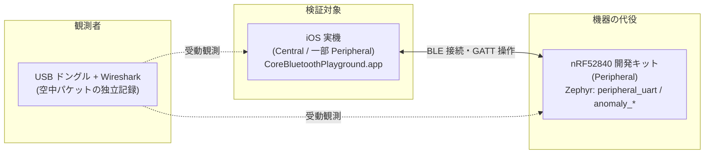
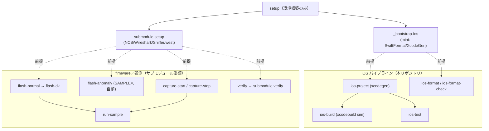
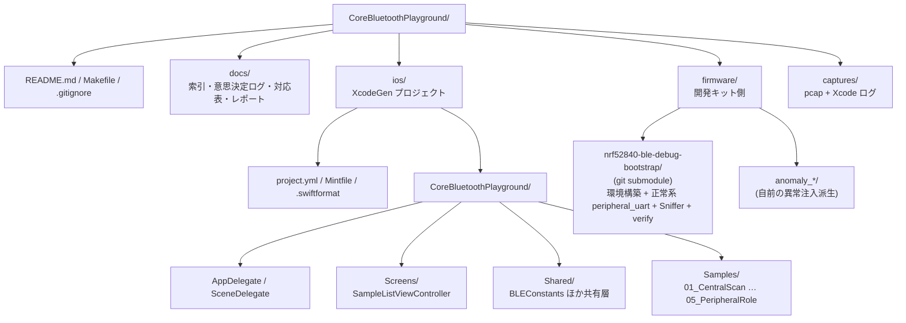
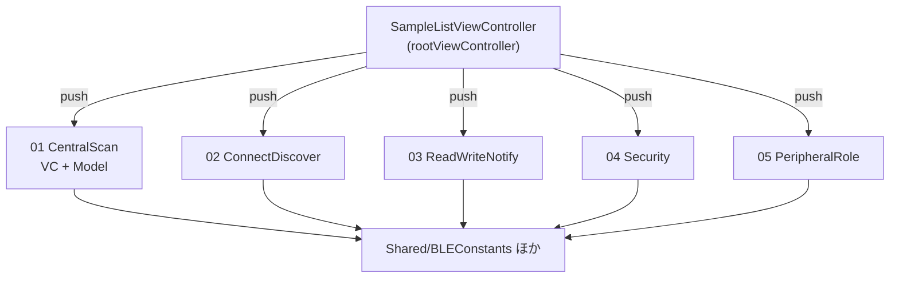
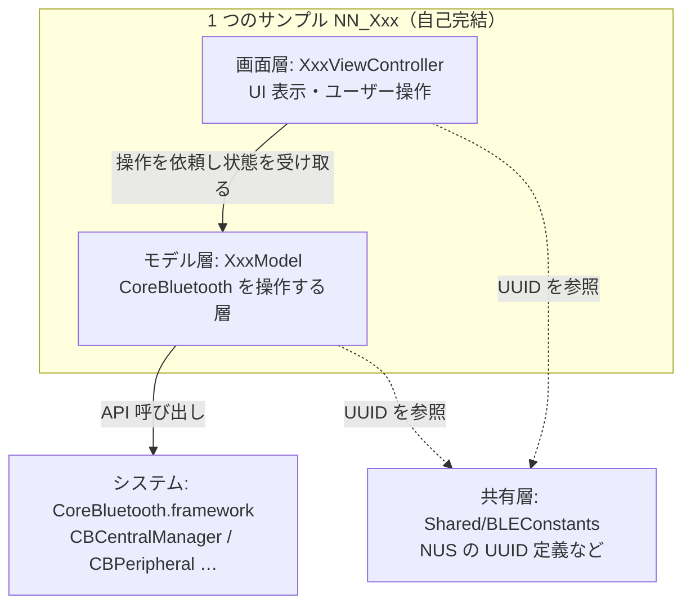
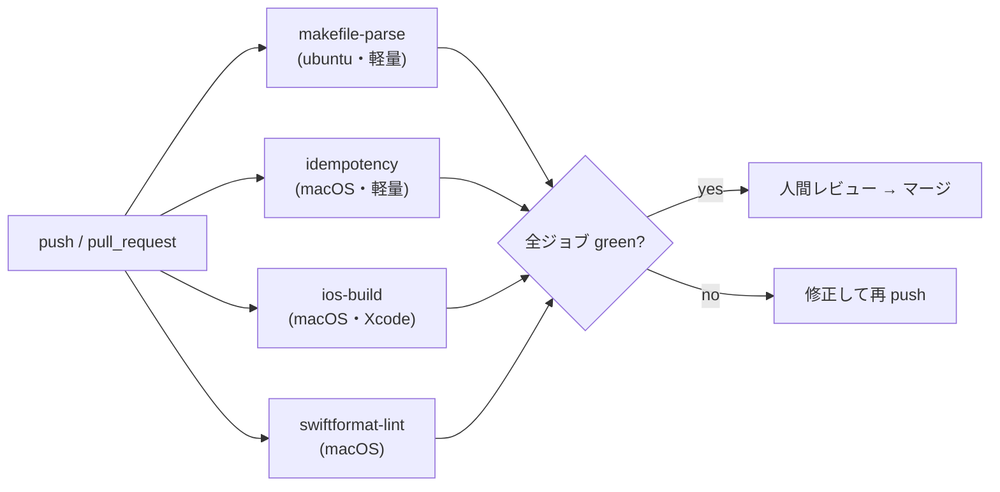
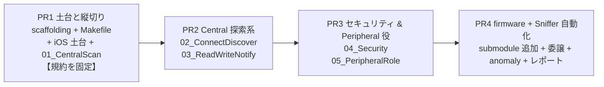
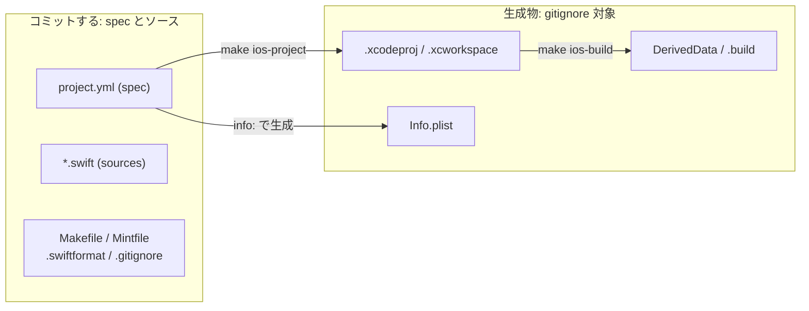
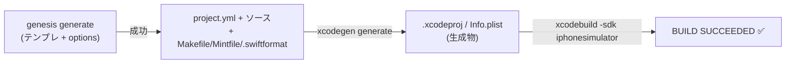
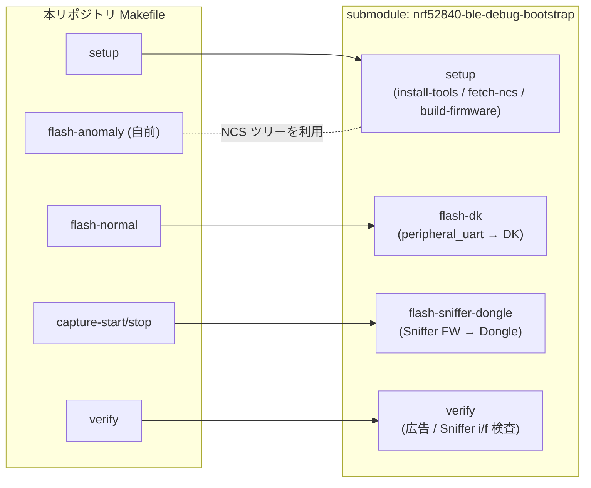

# 実装計画書 — Core Bluetooth サンプルコード集リポジトリ

**対象設計書:** DESIGN-002（サンプルコード集リポジトリ設計書）
**日付:** 2026-06-02
**前提:** 単一アプリ + サンプル一覧メニュー / UIKit（テンプレート踏襲）/ フェーズ分割は本書で確定

---

## 目次

| 章 | 題 |
| --- | --- |
| 1 | 背景と目的 |
| 2 | Makefile の設計（コマンド面の確定） |
| 3 | リポジトリ構造の確定 |
| 4 | GitHub Actions の設計（機械ゲート） |
| 5 | フェーズ分割 |
| 6 | 規約 |
| 7 | 検証方法 |
| 8 | 開発ループとエスカレーション |
| 付録 A | インターフェース先行の方針（設計判断ノート） |
| 付録 B | 目標規定文（実装計画メモ） |
| 付録 C | コミット方針（spec + ソースのみ。生成物は持たない） |
| 付録 D | テンプレートの扱い（フィージビリティ実測済み） |
| 付録 E | firmware 環境（サブモジュール委譲） |

---

## 1. 背景と目的

本リポジトリの目的は、本番アプリケーションの構築ではなく、Core Bluetooth フレームワークの**挙動を単独で確認する**ことにある。本実装計画は、実運用に耐える単一アプリ構成へ落とし込み、機械検証可能なフェーズへ分割することを目的とする。

検証は三者で成立する。Central 役を iOS 実機が担い、これが本来確認したいアプリ側の挙動である。Peripheral 役は nRF52840 開発キット上の Zephyr ファームウェアが担い、正常系と異常系を切り替えて機器側の振る舞いを完全に制御する。そして USB ドングルと Wireshark が空中のパケットを独立に記録し、客観的証拠を残す。この三者関係を次に示す。

開発キットとファームウェアは観測対象であり実装の中心ではない。本計画の主成果物は **iOS サンプルアプリ**と、検証手順を自動化する **Makefile** である。

---

## 2. Makefile の設計（コマンド面の確定）

本章では、検証手順を駆動するコマンド面、すなわち Makefile のターゲット群を確定する。構造やフェーズの詳細に入る前にこのコマンド面を固定し、後続のすべてのフェーズがこの面を拠り所にできるようにする。この順序を採る意図は付録 A に記す。

Makefile は下表（2.1 節）に定める全ターゲット面を最初から定義する。`help` を `.DEFAULT_GOAL` とし、各ターゲットの `## ` コメントから自己文書化する。冪等性は which による存在検査・`test -f` による設定検査・依存ガードで担保する。

**firmware と観測（Sniffer）の環境構築・書き込み・検証は自前で再発明せず、git サブモジュール `nrf52840-ble-debug-bootstrap` の Makefile へ委譲する**。サブモジュールの責務・ターゲット・変数の 3 点は付録 E に整理する。すなわち `setup` は firmware 側をサブモジュールの `make setup` に任せる。これは NCS・Wireshark・nRF Sniffer・nrfjprg/J-Link・west の 5 つのツールの導入と、正常系 `peripheral_uart` のビルドまでを行う。`flash-normal` はサブモジュールの `flash-dk`、`verify` はサブモジュールの `verify` を呼ぶ。`flash-anomaly` のみ、サブモジュールが取得した NCS ツリーを使って本リポジトリの `firmware/anomaly_*/` をビルド・書き込みする自前処理とする。これらハードウェア依存ターゲットは、サブモジュール未取得・実機未接続のときは回復手順（`git submodule update --init` / `make setup`）を示して停止する（依存ガード）。各ターゲットをどのフェーズで実装するかは 5 章に示す。

`setup` は**環境構築に限る**ターゲットであり、アプリのビルドや実機書き込みは含まない。iOS 用ツールの導入（`_bootstrap-ios`）と firmware／観測環境（サブモジュールの `setup`）という二つの独立した前提を用意するだけで、両者に依存関係はない（既定は逐次、`-j` で並列も可）。ビルド・書き込み・検証は、これら前提を共有する別系統のターゲットとして起動する。この分離はサブモジュールが setup / deploy / verify を分けているのと同じ考え方である。ターゲットの依存関係を次に示す。

### 2.1 ターゲット一覧（想定インターフェース）

確定させるコマンド面を下表に定義する。`help` を既定とし Makefile 冒頭に置く。アンダースコア始まりは内部ターゲットで直接実行を想定しない。ツール・サブモジュール・実機の 3 つの前提のいずれかを欠く場合は、各ターゲットが回復手順（`make setup` や `git submodule update --init`）を示して停止する（依存ガード）。各ターゲットをどのフェーズで実装するかは 5 章に示す。

| ターゲット | 依存先 | 責務 | 冪等性の保ち方 |
| --- | --- | --- | --- |
| `help` | — | 全ターゲットを説明付きで表示する自己文書化の入口（既定ゴール）。 | 読み取り専用。 |
| `setup` | `_bootstrap-ios`, submodule `setup` | iOS 側は mint を bootstrap、firmware／観測系はサブモジュールの `make setup` へ委譲。 | 委譲先の冪等性に依存。 |
| `_bootstrap-ios` | — | iOS 用ツール（mint 経由で SwiftFormat / XcodeGen を SHA 固定導入）。 | which で存在検査しスキップ。 |
| `upgrade` | — | 導入済みツールをアップグレード。未導入は setup を促す。 | 最新時は変化しない。 |
| `ios-project` | `_bootstrap-ios` | `project.yml` から `.xcodeproj` を生成（XcodeGen）。 | 同一 spec の再生成は結果不変。 |
| `ios-build` | `ios-project` | シミュレータ向けにビルド（署名無効化フラグ付き）。 | 入力不変なら成果物不変。 |
| `ios-format` | — | Swift ソースを整形（SwiftFormat）。 | 整形後は再実行で変化しない。 |
| `ios-format-check` | — | 整形差分を検査（`--lint`、書き込みなし）。 | 読み取り専用。 |
| `ios-test` | `ios-project` | シミュレータでテスト実行。 | 読み取り専用（成果物を変えない）。 |
| `flash-normal` | submodule `setup` | 正常系 `peripheral_uart` を DK へ書き込む（サブモジュールの `flash-dk` へ委譲）。 | 同一 FW の再書き込みは結果不変。 |
| `flash-anomaly` | submodule `setup` | `SAMPLE` 指定の `firmware/anomaly_*` を NCS ツリーでビルドし DK へ書き込む（自前）。未指定はエラー。 | 対象のみ変数で切替、再書き込み不変。 |
| `capture-start` | submodule `setup` | nRF Sniffer の extcap 経由で pcap 記録を開始（Sniffer ドングルはサブモジュールの `flash-sniffer-dongle` で準備）。 | プロセス存在検査で二重起動を防ぐ。 |
| `capture-stop` | — | キャプチャを停止し pcap を確定保存。未起動でも正常終了。 | 対象不在でもエラーにしない。 |
| `verify` | submodule `setup` | 環境整備の正否を検査（DK が広告しているか・Sniffer インタフェースが現れるか。サブモジュールの `verify` へ委譲）。 | 読み取り専用。 |
| `run-sample` | `flash-*`, `capture-start` | `SAMPLE` の検証準備（書き込み + キャプチャ開始）を一括実行する起点。 | 依存先がすべて冪等。 |
| `collect` | — | Xcode ログと pcap を対にして `captures/` へ整理。 | タイムスタンプ付与で衝突回避。 |
| `list-samples` | — | 利用可能なサンプルと対応インターフェースの一覧を表示。 | 読み取り専用。 |
| `clean` | — | ビルド成果物を削除（ツール / ソース本体には干渉しない）。 | `rm -f` で対象不在でも正常終了。 |
| `clean-captures` | — | `captures/` のキャプチャ成果物を削除。 | 対象不在でも正常終了。 |
| `reset` | — | 生成物を削除し初期状態へ戻す。再構築は `setup`。 | 削除対象不在でも正常終了。 |

### 2.2 開発オプション（変数インターフェース）

ターゲットの挙動を制御する変数を下表に定める。いずれもコマンドライン引数での指定を前提とし、未指定時は安全側の既定値または明示エラーを採る。firmware 系の変数（`BOARD` / `NCS_VERSION` / `SERIAL_PORT`）はサブモジュールへそのまま引き渡すため、既定値と意味はサブモジュールに合わせる（付録 E）。

| オプション | 用途 | 指定例 | 注記 |
| --- | --- | --- | --- |
| `SAMPLE` | 検証対象サンプルの指定 | `run-sample SAMPLE=03_read_write_notify` | `flash-anomaly` / `run-sample` で必須。未指定はエラー。 |
| `BOARD` | ビルド対象ボードの指定 | `flash-normal BOARD=nrf52840dk_nrf52840` | 既定値は `nrf52840dk_nrf52840`（サブモジュール準拠）。 |
| `SERIAL_PORT` | 書き込み対象ドングルの**シリアル番号** | `flash-anomaly SERIAL_PORT=683XXXXXX` | tty パスではなくシリアル番号。未指定は DFU 検出で自動選択、複数検出時に指定（サブモジュール準拠）。 |
| `CAPTURE_NAME` | 保存 pcap ファイル名 | `capture-start CAPTURE_NAME=read_anomaly` | 未指定はサンプル名 + タイムスタンプで自動命名。 |
| `NCS_VERSION` | nRF Connect SDK バージョン固定 | `setup NCS_VERSION=v2.6.1` | 既定値は `v2.6.1`（サブモジュール準拠）。バージョン不整合によるビルド失敗を防ぐ。 |
| `VERBOSE` | 詳細ログの出力切替 | `run-sample VERBOSE=1` | 既定は抑制。トラブルシュート時に有効化。 |

---

## 3. リポジトリ構造の確定

本リポジトリは「単一アプリ + サンプル一覧メニュー」構成を採り、署名・ビルドを一度で済ませつつ実機で即座に試せるようにする。サンプルの独立性は **アプリ内のフォルダ分離**で担保する。すなわち各サンプルは `Samples/NN_Xxx/` に閉じ、共有コードは `Shared/` のみに置き、サンプル間の相互依存を作らない。これにより任意のサンプルを単独で開いて読める。

リポジトリ全体の構造を次に示す。`ios/` 配下が iOS アプリ、`firmware/` 配下が開発キットのファームウェア、`captures/` がキャプチャ保存先、`docs/` が文書である。

iOS アプリの内部は、起動時にサンプル一覧メニューを表示し、行を選ぶと対応するサンプル画面へ遷移する単純な構造とする。各サンプル画面は自分のモデル（CoreBluetooth を操作する層）と画面を持ち、共有層の `BLEConstants`（Nordic UART Service の UUID 定義など）のみを参照する。

1 つのサンプルの層構成を次に示す。画面層とモデル層はサンプル内に閉じ、サンプル外への依存は共有層の `BLEConstants` とシステムの CoreBluetooth.framework の 2 つだけである。点線は「参照のみ（状態を変えない）」を表す。

---

## 4. GitHub Actions の設計（機械ゲート）

人間によるレビューの前に、自動ゲートが green であることを前提とする。CI は GitHub Actions で構成し、検証可能なもの、すなわちビルド・パース・実行ができるかは、意見ではなく事実に判定させる。重いツール（Xcode）を要するジョブと要さないジョブを分割し、軽量チェックはツールが無くても常時回るようにする。DK・ドングル・NCS・Wireshark の 4 つに依存する firmware／観測ターゲットは CI で実行できないため、CI は「構造の妥当性」と「ハードウェア非依存ターゲットの冪等性」を検証し、実機検証は `docs/` の手順書と手動検証で補う。この切り分けはサブモジュール `nrf52840-ble-debug-bootstrap` の CI（dry-run パース／冪等性／install スモーク）に倣う。テンプレート同梱の TestFlight・Danger ワークフローは採らず、本リポジトリ独自の検証ワークフロー（`.github/workflows/`）を置く。

ジョブは次のとおり分割する。

| ジョブ | ランナー | 内容 | 重い依存 |
| --- | --- | --- | --- |
| `makefile-parse` | ubuntu | 全ターゲットの `make -n` dry-run パース、`.PHONY` 網羅、既定ゴール = help、依存ガードの存在を検証。 | なし |
| `idempotency` | macOS | 読み取り専用ターゲットと `clean` / `clean-captures` を 2 回実行し、最終状態が不変であることを確認。 | なし |
| `ios-build` | macOS | `xcodegen generate` → `xcodebuild -sdk iphonesimulator`（署名無効）でビルドが通ること。 | Xcode |
| `swiftformat-lint` | macOS | `swiftformat --lint` で整形差分が無いこと。 | mint / SwiftFormat |

CI で実行できない範囲を明示する。firmware のビルド・実機書き込み（`flash-*`）、Sniffer キャプチャ（`capture-*`）、環境検証（`verify`）は DK・ドングル・NCS・Wireshark を要するため CI 対象外であり、手順書と実機での手動検証で補う。サブモジュールは SHA 固定で取り込み、その冪等性は submodule 側の CI が担保するため、本リポジトリの CI では submodule の重い `setup` を再実行しない。

---

## 5. フェーズ分割

フェーズは「成果物とそれを証明する機械検証をペアにした 1 PR」を単位とする。最初の PR で最もリスクの高い統合点を薄く貫いて**規約を固定**し、それがマージされた後に残りを展開する。開発ループは一本に保ち、サブエージェントが worktree 内で実装 → Claude がレビュー → 未解決 issue が無ければ PR 作成 → 人間レビュー → マージ、の順で進める。

各 PR の責務は次のとおり。第 2 章で確定したコマンド面のうち、PR1 では iOS 系を実働させ、firmware 系は依存ガードのまま据え置く。PR4 でその本体を埋める。

| PR | 主な成果物 | 機械検証 |
| --- | --- | --- |
| PR1 | `README` / `.gitignore` / `docs/`（索引・意思決定ログ・対応表の種）/ `Makefile`（第 2 章の全ターゲット面、iOS 系は実働・firmware 系は依存ガード）/ `.github/workflows/`（4 章の CI: makefile-parse / idempotency / ios-build / swiftformat-lint）/ iOS 土台（`project.yml`・`Mintfile`・`.swiftformat`・`AppDelegate`・`SceneDelegate`・`SampleListViewController`・`Shared/BLEConstants`）/ **01_CentralScan を完全実装** | `xcodegen generate` 成功、`make ios-build` green、`make ios-format-check` 差分なし、`make list-samples`/`make help` 表示（CI 4 ジョブが green） |
| PR2 | `02_ConnectDiscover`（connect / discoverServices / discoverCharacteristics、UUID 指定有無の差）、`03_ReadWriteNotify`（read / write withResponse・withoutResponse / setNotifyValue / 各 didUpdate）。一覧へ追加 | build green + format-check |
| PR3 | `04_Security`（暗号化要求キャラへの Read、ペアリング起動、didDisconnect、CBATTError 分類）、`05_PeripheralRole`（CBPeripheralManager で add(service)/startAdvertising/didReceiveRead/Write/updateValue）。Info.plist に Peripheral 用途文言を追加 | build green + format-check |
| PR4 | サブモジュール `nrf52840-ble-debug-bootstrap` を `firmware/` に追加、Makefile の `setup`/`flash-normal`/`capture-*`/`verify` をサブモジュールへ委譲、`firmware/anomaly_*`（異常注入派生）と `flash-anomaly` の自前ビルド、`docs/` レポート雛形 | サブモジュール側 CI（dry-run パース・冪等性）に倣い、本体 Makefile も `make -n` パースと委譲先存在ガードを検証（NCS/west/Wireshark/実機はハードウェア依存で CI 不可、手順書で補う） |

PR1 が最も重いが、これは playbook の「縦切り（vertical slice）」に相当する。ここで SwiftFormat 設定・Makefile の冪等パターン・サンプルのフォルダ分離・命名規約をすべて確定させ、PR2 以降は確定済みの型に沿ってサンプルを足すだけにする。

---

## 6. 規約（PR1 で固定し全 PR が従う）

フォルダ命名は設計書の `NN_snake_case`（例 `01_central_scan`）を踏襲し、対応表とのトレーサビリティを保つ。Swift の型名は PascalCase（例 `CentralScanViewController` / `CentralScanModel`）とする。サンプルは `Samples/NN_Xxx/` に閉じ、共有は `Shared/` のみへ置き、サンプル間で相互参照しない。SwiftFormat 設定はテンプレートと同一（インデント 4・最大幅 120・`organizeDeclarations`・頭字語 ID/URL/UUID）とする。Makefile は `## ` で自己文書化し、内部ターゲットは `_` 始まりとして直接実行を想定しない。

---

## 7. 検証方法（機械のみ）

PR1（以降の iOS フェーズも同型）の検証は次のコマンド列で完結する。

1. `cd ios && mint run yonaskolb/XcodeGen xcodegen generate` — XcodeGen プロジェクト生成が成功する。
2. `make ios-build` — `xcodebuild -sdk iphonesimulator` ビルドが green（署名無効化フラグ付き）。
3. `make ios-format-check` — `swiftformat --lint` で差分が無い。
4. `make list-samples` — 実装済みサンプルが列挙される。
5. `make help` — 全ターゲットが説明付きで表示される。

firmware（PR4）はハードウェア依存のため、機械検証は設定ファイル（`prj.conf` / `CMakeLists.txt`）の構文・参照 sanity に限定し、実機での書き込み・キャプチャは手順書で補う。

---

## 8. 開発ループとエスカレーション

実装はサブエージェントへ `isolation:"worktree"` で委譲し、Claude が仕様適合・全分岐の両枝・命名/規約の一貫性をレビューする。自動ゲート、すなわちビルドと format-check が green であることを人間レビューの前提とする。技術的に未決の点は多視点サブエージェントで論じ尽くし、価値のトレードオフや不可逆な決定など本物の意思決定のみを AskUserQuestion で 1 枚の意思決定カードとして提示する。

---

## 付録 A. インターフェース先行の方針について（設計判断ノート）

本計画では、リポジトリ構造やフェーズの詳細より先に Makefile のターゲット群（2 章）を確定させた。これは実装を統括する立場からの方針判断であり、根拠は次のとおりである。作り始めの段階ほどインターフェースの設計にこだわると後半が楽になる。コマンド名と契約、すなわち依存・冪等性・未充足時の振る舞いの 3 点を先に固定しておけば、実装本体が後から差し替わってもインターフェースは不変に保たれ、各フェーズはこの不変点を拠り所に独立して進められる。逆にインターフェースを後付けにすると、フェーズごとに呼び出し方が揺れ、検証手順そのものが安定しない。本計画が Makefile を 2 章という早い位置に置いたのは、この安定点を最初に打ち込むためである。

---

## 付録 B. 目標規定文（実装計画メモ）

目標規定文は本文の構成要素ではなく、各章で何を確定させるべきかを実装側（統括役）が見失わないための作業メモである。本文・目次には置かず、ここに一覧としてまとめる。

| 章 | 目標規定文 |
| --- | --- |
| 1 背景と目的 | 本リポジトリが挙動確認に目的を限定すること、および三者（iOS・開発キット・観測者）の役割を確定する。 |
| 2 Makefile の設計 | 検証手順を駆動するコマンド・インターフェースを最初に固定し、後続フェーズの拠り所とする。 |
| 3 リポジトリ構造の確定 | 単一アプリ + メニュー方針の下で、サンプルの独立性をフォルダ分離で担保する構造を定義する。 |
| 4 GitHub Actions の設計 | 人間レビューの前段に置く機械ゲート（CI）の構成と、ハードウェア依存部を CI 対象外とする切り分けを定義する。 |
| 5 フェーズ分割 | 成果物と機械検証をペアにした 4 つの PR を定義し、規約固定の順序を確定する。 |
| 6 規約 | PR1 で固定し全 PR が従う命名・フォルダ分離・整形・自己文書化の規約を定義する。 |
| 7 検証方法 | 機械のみで完結する検証コマンド列と、ハードウェア依存部の扱いを定義する。 |
| 8 開発ループとエスカレーション | 委譲・レビュー・PR・意思決定カードの運用を定義する。 |
| 付録 A | コマンド面を実装本体より先に確定させる順序を採った意図を、統括役（リードエンジニア）からの補足として記録する。 |
| 付録 D テンプレートの扱い | iOSAppTemplate で土台を一度 bootstrap し不要レイヤを除去する方針を、フィージビリティ実測とともに確定する。 |

---

## 付録 C. コミット方針（spec + ソースのみ。生成物は持たない）

リポジトリへコミットするのは **spec（XcodeGen の `project.yml`）と Swift ソース、および設定ファイル（`Makefile` / `Mintfile` / `.swiftformat` / `.gitignore`）のみ**とする。`.xcodeproj` / `.xcworkspace` / 生成される `Info.plist` / `DerivedData` / `.build` は**コミットしない**。`.xcodeproj` は `make ios-project`（`xcodegen generate`）でいつでも再生成できるため、生成物をリポジトリに残す必要がない。この除外はテンプレート標準の `.gitignore` がそのまま担保する（付録 D のフィージビリティ確認で実測）。

---

## 付録 D. テンプレートの扱い（フィージビリティ実測済み）

ユーザーが提示した `koki-mobile-studio/iOSAppTemplate` は Genesis ベースの**スタンドアロンアプリ生成器**であり、`make app-generate` を実行すると親ディレクトリ `../<アプリ名>/` に、fastlane・CI・Danger・CoreData/UserDefaults レイヤを伴う単独アプリを生成する。

本計画では机上判断に留めず、`/tmp` 上で実際に生成器を走らせて成否を確認した。結果は次のとおりで、**生成 → プロジェクト生成 → シミュレータビルドまで一気通貫で green** であった。

実測で判明した二点を方針に織り込む。第一に、テンプレート生成物の `.gitignore` は `*.xcodeproj` / `*.xcworkspace` / 生成された `Info.plist` を初めから除外しており、「コミットするのは spec + ソースだけ、生成物は持たない」という方針はテンプレート標準そのものである（付録 C で明文化）。第二に、`--options` で `usePersistence:false` / `usePreferences:false` を渡しても **boolean が無視され** Persistence/Preferences の Package レイヤと依存が生成された（Genesis 0.9.0 の非対話モードの挙動）。

これらを踏まえ、本計画は **生成器で土台を一度だけ bootstrap し、不要レイヤを除去して適応する**方針を採る。すなわち XcodeGen の `project.yml`、Mint による SwiftFormat / XcodeGen の SHA 固定、テンプレートと同一の `.swiftformat`、UIKit（`AppDelegate` / `SceneDelegate` / `UIViewController` + Auto Layout）、Makefile の自己文書化 `help` パターンを採用する。一方で playground に不要な fastlane・TestFlight・Danger・Persistence/Preferences レイヤと、それらへの `project.yml` の参照は bootstrap 後に除去する。Makefile は最小生成版を本書 2 章のターゲット面で置き換える。なお Genesis 専用の `genesis.yml` は生成器側（テンプレート）の関心事であり、具象アプリである本リポジトリには持ち込まない。これらの判断は意思決定ログ（`docs/DECISIONS.md`）へ記録し、PR から参照する。

---

## 付録 E. firmware 環境（サブモジュール委譲）

firmware と観測（Sniffer）の環境構築・書き込み・検証は、既存リポジトリ `kokiTakashiki/nrf52840-ble-debug-bootstrap` を git サブモジュールとして取り込み、その Makefile へ委譲する。同リポジトリは nRF52840 DK を BLE Peripheral（被検証側 / DUT）、nRF52840 ドングルを nRF Sniffer（観測側）として立ち上げる環境を Apple Silicon Mac 上に 1 ステップで構築し、`make verify` で「DK が広告しているか・Wireshark に Sniffer インタフェースが現れるか」を検査する。submodule 利用が前提設計であり、本リポジトリの firmware／観測レイヤをこれで賄う。

これにより本リポジトリは NCS・Wireshark・nRF Sniffer・nrfjprg/J-Link・west の導入手順を自前で持たない。正常系 `peripheral_uart` のビルド・書き込みもサブモジュールが担い、本リポジトリが書くのは異常注入の派生 `firmware/anomaly_*/`（取得済み NCS ツリーに対する out-of-tree Zephyr アプリ）のみとする。

委譲関係を次に示す。

委譲先の主なターゲットと変数は次のとおり（一次情報はサブモジュール README）。

| サブモジュール側 | 役割 |
| --- | --- |
| `make setup` | check-os → ツール導入 → NCS ソースツリー取得 → `peripheral_uart` ビルド（実機不要で完走） |
| `make flash-dk` | DK へ `peripheral_uart` を書き込む（要 DK 接続） |
| `make flash-sniffer-dongle` | ドングルへ Sniffer ファームウェアを Open Bootloader DFU で書き込む |
| `make verify` | 書き込み（任意）+ 広告／Sniffer インタフェースの検査 |
| `make clean` | ビルド成果物を削除 |

| サブモジュール変数 | 既定値 | 意味 |
| --- | --- | --- |
| `NCS_VERSION` | `v2.6.1` | 使用する nRF Connect SDK バージョン |
| `BOARD` | `nrf52840dk_nrf52840` | ビルド対象ボード |
| `SERIAL_PORT` | 自動検出 | 書き込み対象ドングルの**シリアル番号**（tty パスではない） |

注意点を二つ記す。第一に、サブモジュールは **Apple Silicon Mac 専用**（`check-os` が arm64 と Homebrew を要求する）であり、iOS 開発も macOS 専用であるため、本リポジトリ全体の対象は macOS/Apple Silicon に限定される。当初の uname による Linux 分岐は対象外として持たない。第二に、初回 `make setup` は NCS の数 GB ダウンロードを伴い時間がかかる。`SERIAL_PORT` がシリアル番号である点も、本体 Makefile から素通しで引き渡すため利用者に明示する。
