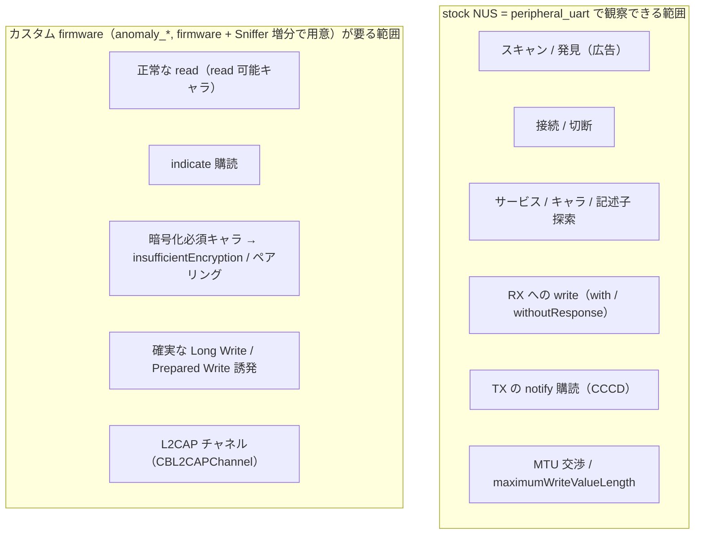

# シグネチャ単位デモ設計書

本書は Apple CoreBluetooth の全シンボルを「シグネチャ単位」でカタログ化し、各シグネチャに対して「ファームウェアを使った実機デモ設計」または「ドキュメントとコード検証による使い勝手の確認」のいずれかを割り当てるマスター設計書である。`docs/IMPLEMENTATION_PLAN.md` の「1 増分 = 1 インターフェース」というロードマップを、クラス粒度ではなくシグネチャ粒度まで落とし込み、各シグネチャを実機でどう観察するか・観察できないなら何をコードで確かめるかを先に決めておくための一覧表として機能する。

---

## 1. 目的とスコープ

本書の対象は Apple が文書化している CoreBluetooth の全シンボルである。クラス・構造体・列挙・プロトコル・OptionSet・トップレベル定数・型エイリアスのすべてを、宣言された個々のシグネチャまで分解して列挙する。非推奨シンボルは原則として除外し、除外したものは各小節の末尾に名前のみを残して理由を添える（iOS 26 / Swift 6 を前提とするため、置換済みの旧 API を実装対象に含めない）。

各シグネチャの観察手段は二系統に分かれる。第一は実機デモである。本リポジトリは nRF52840 開発キットへ書き込んだファームウェア（サブモジュール `nrf52840-ble-debug-bootstrap` が焼く Nordic 純正 `peripheral_uart`、および将来本リポジトリが自前で書く `anomaly_*` 派生）を対向機器とし、iOS 実機を Central 役（一部の章では Peripheral 役）として実際に BLE 通信を起こして振る舞いを観察する。第二はドキュメントとコード検証である。BLE の入出力（I/O）を伴わずローカルで完結するシグネチャや、基底クラス・定数・型エイリアスのように操作対象を持たないシグネチャは、実機デモにならない。これらは Apple ドキュメントの意味づけを記述したうえで、コード上でどう書けるか・どんな値や型が得られるかを検証して使い勝手を確かめる。

本書はリビング文書である。各シグネチャの「使い勝手(状態)」列は、対応する実装増分が完了するたびに後から追記していく前提で運用する。現時点で実装済みなのは CBCentralManager（PR1）と CBPeripheral 周辺（PR2）であり、それ以外の多くは「コード検証待ち」のまま置いている。実装が進むにつれてこの列が「実装済み(PR#)」へ書き換わっていく。最初に全シグネチャの棚卸しとデモ設計を確定させ、使い勝手の知見だけを増分ごとに足していくという運用方針は意思決定ログ D-020 に記録した。

---

## 2. 凡例

### 2.1 カタログ表の列

後続のカテゴリ章では、各クラス・型ごとに次の 6 列からなるカタログ表を置く。列の意味は全章で共通である。

- **シグネチャ**: Swift 表記での正確なシンボル宣言。素材調査で補正した型表記をそのまま反映する。たとえば `centralManager(_:didDisconnectPeripheral:error:)` は旧シグネチャと iOS 17 の新シグネチャを別行として両方載せ、`readValue` / `writeValue` はキャラクタリスティック版と記述子版のオーバーロードを別行に分け、`CBError` / `CBATTError` は struct 本体と入れ子の `enum Code` を別扱いで載せる。
- **種別**: そのシグネチャの分類。`init` / `property` / `method` / `delegate` / `enum-case` / `constant` / `option` のいずれかを用いる。`option` は OptionSet の静的メンバを指す。
- **扱い**: 観察手段の 4 区分（次節）。
- **観察する振る舞い**: そのシグネチャで実際に何を観察または確認するかを 1 行で示す。
- **デモ方法 / 検証メモ**: 「デモ」系であれば必要なファームウェアと操作の要点、「doc+コード検証」系であれば何をコードで確かめるかの要点。
- **使い勝手(状態)**: 既に実装で検証済みのものは「実装済み(PR#)」、未実装のものは「コード検証待ち」。CBCharacteristic は次増分のため「次増分で検証」と置く。

### 2.2 「扱い」の 4 区分

「扱い」列は次の 4 値で統一する。判定は素材調査の「I/O 要否」と第 3 章のファームウェア能力表から機械的に導く。

- **デモ(NUS)**: stock ファームウェアである `peripheral_uart`（Nordic UART Service、以下 NUS）に対して、iOS から実際に BLE I/O を起こして観察できるもの。探索・接続/切断・write（両モード）・notify 購読・MTU 交渉がこれに当たる。
- **デモ(要カスタムFW)**: iOS を Central 役としたまま観察に BLE I/O を要するが、stock NUS の GATT には対象となる属性が存在しないため、`anomaly_*` のようなカスタム GATT を持つ開発キット側ファームウェアが別途必要なもの。正常な read、indicate、暗号化必須キャラクタリスティックへのアクセス、L2CAP チャネルなどが該当する。
- **デモ(要対向Central)**: iOS 自身を Peripheral 役として動かし、観察に別の Central（対向の iOS / Mac など）との BLE I/O を要するもの。対向は別の Central であって開発キットの GATT firmware には依存しない。CBPeripheralManager 系の購読・要求応答・通知送信・L2CAP 公開などが該当する。
- **doc+コード検証**: BLE I/O を伴わずローカルで完結する、あるいは基底クラス・定数・型エイリアス・OptionSet メンバのように操作対象を持たないため、そもそも実機デモの形にならないもの。Apple ドキュメントの意味づけとコード上の書き味を確かめる対象とする。

### 2.3 観察軸

本書で言う「観察軸」とは、あるシグネチャを通じて CoreBluetooth の何を確かめたいのかという問いの立て方である。本リポジトリの観察軸は一貫して「CoreBluetooth が外から見せる振る舞い」であり、実装側の型名やアプリの UI ではない（ログのラベル規約も同じ軸で揃える方針を D-015 で定めている）。具体的には、(a) 呼び出しに対してどのデリゲートコールバックがどんな引数で発火するか、(b) プロパティがどのタイミングでどんな値に反映されるか、(c) 異常な操作に対してどのエラーコード（`CBError.Code` / `CBATTError.Code`）が返るか、の 3 つを軸として各シグネチャの「観察する振る舞い」列を立てている。

---

## 3. ファームウェア前提（デモ可否の土台）

実機デモの可否は、対向機器の GATT が何を公開しているかで決まる。サブモジュール `nrf52840-ble-debug-bootstrap` は firmware 本体を持たず、Nordic 純正サンプル `peripheral_uart`（NUS）をそのままビルドして開発キットへ書き込むツールである。したがって stock 構成で観察できる範囲は NUS が公開する GATT に限られる。その GATT を次に示す。

| 役割 | UUID | properties | 向き（Central = iOS 視点） | 暗号化要求 |
| --- | --- | --- | --- | --- |
| NUS Service | `6E400001-B5A3-F393-E0A9-E50E24DCCA9E` | （サービス） | — | なし |
| RX Characteristic | `6E400002-B5A3-F393-E0A9-E50E24DCCA9E` | Write, Write Without Response | Central → Peripheral（iPhone が送る上り） | なし |
| TX Characteristic | `6E400003-B5A3-F393-E0A9-E50E24DCCA9E` | Notify（CCCD あり） | Peripheral → Central（開発キットが返す下り） | なし |

この GATT には read プロパティを持つキャラクタリスティックが無く、indicate も無く、暗号化やペアリングの要求も無く、L2CAP チャネルの公開も無い。そのため stock NUS で観察できるのは、スキャンと発見、接続と切断、サービスとキャラクタリスティックの探索、RX への write（応答ありと応答なしの両モード）、TX の notify 購読、そして MTU 交渉までである。これらは BLE I/O を伴うが NUS の GATT だけで完結するため「デモ(NUS)」に分類する。

一方で、正常な read の観察、indicate の購読、暗号化必須キャラクタリスティックへのアクセスとそれに伴う `CBATTError.insufficientEncryption` やペアリングの誘発、確実な Long Write の誘発、L2CAP チャネルの開設は、いずれも stock NUS の GATT に対象が存在しない。これらを実機デモ化するには、read 可能なキャラクタリスティック・indicate キャラクタリスティック・暗号化権限を付けたキャラクタリスティック・L2CAP CoC を公開するカスタム GATT（本書では `anomaly_*` と総称する）が必要であり、「デモ(要カスタムFW)」に分類する。なお、このカスタム firmware 本体（`firmware/anomaly_*/` の自前ビルド）はまだ着手しておらず、実装計画の付録 E が定める firmware + Sniffer 増分で初めて用意される想定である。したがって本書で「デモ(要カスタムFW)」と分類したシグネチャの実機観察は、その firmware + Sniffer 増分が入るまで保留となる。

stock NUS で完結する範囲と、カスタム firmware を要する範囲の切り分けを次に示す。

---

## 4. カテゴリ章

以下、Apple ドキュメントのカテゴリ順（Centrals / Peripherals / Services / Supporting / Errors / Variables）に各クラス・型のカタログ表を置く。各小節は 1 文の役割説明と、第 2 章で定めた 6 列のカタログ表からなる。

### 4.1 Centrals

#### CBCentralManager

中央（セントラル）として周辺機器のスキャン・接続・取得を統括するマネージャである。

| シグネチャ | 種別 | 扱い | 観察する振る舞い | デモ方法 / 検証メモ | 使い勝手(状態) |
| --- | --- | --- | --- | --- | --- |
| `convenience init()` | init | doc+コード検証 | デリゲートなし初期化が可能なこと | コードで生成し state 初期値が `.unknown` であることを確認 | 実装済み(PR1) |
| `convenience init(delegate:queue:)` | init | doc+コード検証 | デリゲートとキューを指定した初期化 | 生成直後に `didUpdateState` が届く配線を確認 | 実装済み(PR1) |
| `init(delegate:queue:options:)` | init | doc+コード検証 | options 付き指定イニシャライザ | `ShowPowerAlertKey` / `RestoreIdentifierKey` を渡して生成 | コード検証待ち |
| `weak var delegate: (any CBCentralManagerDelegate)?` | property | doc+コード検証 | イベント受信先の差し替え | 弱参照であることと再代入の影響を確認 | 実装済み(PR1) |
| `var isScanning: Bool` | property | デモ(NUS) | スキャン中フラグの遷移 | scan 開始/停止前後で値が変わるのを観察 | 実装済み(PR1) |
| `func scanForPeripherals(withServices:options:)` | method | デモ(NUS) | NUS 広告の発見 | NUS Service UUID で絞って `didDiscover` 発火を観察 | 実装済み(PR1) |
| `func stopScan()` | method | doc+コード検証 | スキャン停止 | 停止後に `isScanning` が false へ戻ることを確認 | 実装済み(PR1) |
| `func connect(_:options:)` | method | デモ(NUS) | 接続確立 | 発見した開発キットへ接続し `didConnect` を観察 | 実装済み(PR1) |
| `func cancelPeripheralConnection(_:)` | method | デモ(NUS) | 接続解除 | 切断要求後に `didDisconnectPeripheral` を観察 | 実装済み(PR1) |
| `func retrieveConnectedPeripherals(withServices:)` | method | デモ(NUS) | システム接続済み機器の取得 | 開発キットに接続した状態で NUS Service UUID を指定し取得を観察 | コード検証待ち |
| `func retrievePeripherals(withIdentifiers:)` | method | doc+コード検証 | 既知 UUID からの再取得 | 過去に接続した identifier を保存し再取得を確認 | コード検証待ち |
| `func registerForConnectionEvents(options:)` | method | デモ(要カスタムFW) | 接続イベント通知の登録 | 条件を登録し `connectionEventDidOccur` 発火を観察 | コード検証待ち |
| `class func supports(_:)` | method | doc+コード検証 | 端末の機能対応判定 | `.extendedScanAndConnect` 対応可否を実機で確認 | コード検証待ち |
| `var state: CBManagerState`（CBManager 継承） | property | doc+コード検証 | 電源状態の参照 | Bluetooth オン/オフで値遷移を確認（実体は Supporting 章） | 実装済み(PR1) |
| `var authorization: CBManagerAuthorization`（CBManager 継承） | property | doc+コード検証 | 認可状態の参照 | 設定で許可/拒否を切替えて値を確認（実体は Supporting 章） | コード検証待ち |

除外（非推奨）: `class var authorization`（旧クラスプロパティ版、iOS 13.0 で非推奨。インスタンス継承版へ移行）。

#### CBCentralManager.Feature

`supports(_:)` に渡す端末機能を表す OptionSet である。

| シグネチャ | 種別 | 扱い | 観察する振る舞い | デモ方法 / 検証メモ | 使い勝手(状態) |
| --- | --- | --- | --- | --- | --- |
| `static var extendedScanAndConnect: CBCentralManager.Feature` | option | doc+コード検証 | 拡張スキャン/接続の対応 | `supports(.extendedScanAndConnect)` の戻り値を確認 | コード検証待ち |

#### CBCentralManagerDelegate

セントラルマネージャの状態変化・発見・接続/切断などのイベントを受け取るデリゲートである。

| シグネチャ | 種別 | 扱い | 観察する振る舞い | デモ方法 / 検証メモ | 使い勝手(状態) |
| --- | --- | --- | --- | --- | --- |
| `centralManagerDidUpdateState(_:)` | delegate | doc+コード検証 | 状態更新の通知（唯一の必須） | 起動直後と電源切替で発火を観察 | 実装済み(PR1) |
| `centralManager(_:didDiscover:advertisementData:rssi:)` | delegate | デモ(NUS) | 発見イベントと広告データ | NUS 広告で発火し advertisementData と RSSI を観察 | 実装済み(PR1) |
| `centralManager(_:didConnect:)` | delegate | デモ(NUS) | 接続成功の通知 | 開発キットへの接続成功を観察 | 実装済み(PR1) |
| `centralManager(_:didFailToConnect:error:)` | delegate | デモ(要カスタムFW) | 接続失敗の通知 | 接続失敗を誘発し error を観察 | コード検証待ち |
| `centralManager(_:didDisconnectPeripheral:error:)`（旧, iOS 5.0） | delegate | デモ(NUS) | 切断の通知（旧シグネチャ） | 切断時に発火する旧版を観察 | 実装済み(PR2) |
| `centralManager(_:didDisconnectPeripheral:timestamp:isReconnecting:error:)`（新, iOS 17.0） | delegate | デモ(NUS) | 切断時刻と再接続フラグ | 自動再接続対応の新版で timestamp / isReconnecting を観察 | コード検証待ち |
| `centralManager(_:willRestoreState:)` | delegate | doc+コード検証 | 状態復元時の引き継ぎ | RestoreIdentifier 付きで復元辞書の中身を確認 | コード検証待ち |
| `centralManager(_:connectionEventDidOccur:for:)` | delegate | デモ(要カスタムFW) | 登録条件一致の接続イベント | registerForConnectionEvents と組で発火を観察 | コード検証待ち |
| `centralManager(_:didUpdateANCSAuthorizationFor:)` | delegate | デモ(要カスタムFW) | ANCS 認可状態の更新 | ANCS 要求接続で認可更新を観察 | コード検証待ち |

#### CBCentral

周辺機器役のとき、自機に接続してきたリモートの中央機器を表す（CBPeer を継承）。

| シグネチャ | 種別 | 扱い | 観察する振る舞い | デモ方法 / 検証メモ | 使い勝手(状態) |
| --- | --- | --- | --- | --- | --- |
| `var maximumUpdateValueLength: Int` | property | デモ(要対向Central) | 1 通知で送れる最大バイト数 | iOS を Peripheral 役にし購読してきた Central の値を観察（CBPeripheralManager 増分） | コード検証待ち |
| `var identifier: UUID`（CBPeer 継承） | property | doc+コード検証 | リモート中央機器の識別子 | 接続中 Central の identifier を確認 | コード検証待ち |

#### CBConnectionEvent

`connectionEventDidOccur` で渡される接続イベント種別の列挙である。

| シグネチャ | 種別 | 扱い | 観察する振る舞い | デモ方法 / 検証メモ | 使い勝手(状態) |
| --- | --- | --- | --- | --- | --- |
| `case peerConnected` | enum-case | デモ(要カスタムFW) | ピア接続イベント | 接続イベント登録下で接続して観察 | コード検証待ち |
| `case peerDisconnected` | enum-case | デモ(要カスタムFW) | ピア切断イベント | 接続イベント登録下で切断して観察 | コード検証待ち |

#### Central 側の定数キー群

`init(options:)` / `scanForPeripherals` / `connect` / `registerForConnectionEvents` / `didDiscover` の辞書で用いる文字列キー群である。`CBConnectionEventMatchingOption` は型付きキー（struct）を主、生文字列定数を従として併記する。

| シグネチャ | 種別 | 扱い | 観察する振る舞い | デモ方法 / 検証メモ | 使い勝手(状態) |
| --- | --- | --- | --- | --- | --- |
| `let CBCentralManagerOptionShowPowerAlertKey: String` | constant | doc+コード検証 | 電源アラート表示の指定 | options 辞書のキーとして用法を確認 | コード検証待ち |
| `let CBCentralManagerOptionRestoreIdentifierKey: String` | constant | doc+コード検証 | 状態復元 ID の指定 | RestoreIdentifier として用法を確認 | コード検証待ち |
| `let CBCentralManagerScanOptionAllowDuplicatesKey: String` | constant | デモ(NUS) | 重複フィルタ無効化 | scan options に渡し `didDiscover` の再発火頻度を観察 | コード検証待ち |
| `let CBCentralManagerScanOptionSolicitedServiceUUIDsKey: String` | constant | デモ(要カスタムFW) | 要請サービス UUID の指定 | 要請サービスを公開する FW で発見挙動を観察 | コード検証待ち |
| `let CBConnectPeripheralOptionNotifyOnConnectionKey: String` | constant | デモ(要カスタムFW) | 接続時アラート表示の指定 | バックグラウンド接続で挙動を観察 | コード検証待ち |
| `let CBConnectPeripheralOptionNotifyOnDisconnectionKey: String` | constant | デモ(要カスタムFW) | 切断時アラート表示の指定 | バックグラウンド切断で挙動を観察 | コード検証待ち |
| `let CBConnectPeripheralOptionNotifyOnNotificationKey: String` | constant | デモ(要カスタムFW) | 通知受信時アラートの指定 | バックグラウンド通知で挙動を観察 | コード検証待ち |
| `let CBConnectPeripheralOptionEnableTransportBridgingKey: String` | constant | デモ(要カスタムFW) | 従来 Bluetooth ブリッジ指定 | ブリッジ可能機器での挙動を観察 | コード検証待ち |
| `let CBConnectPeripheralOptionRequiresANCS: String` | constant | デモ(要カスタムFW) | ANCS 要求の指定 | ANCS 要求接続で挙動を観察 | コード検証待ち |
| `let CBConnectPeripheralOptionStartDelayKey: String` | constant | デモ(要カスタムFW) | 接続保留遅延の指定 | 遅延付き接続要求の挙動を観察 | コード検証待ち |
| `static let CBConnectionEventMatchingOption.peripheralUUIDs`（基底 `CBConnectionEventMatchingOptionPeripheralUUIDs`） | option | デモ(要カスタムFW) | 一致対象 周辺機器 UUID | registerForConnectionEvents に渡して観察 | コード検証待ち |
| `static let CBConnectionEventMatchingOption.serviceUUIDs`（基底 `CBConnectionEventMatchingOptionServiceUUIDs`） | option | デモ(要カスタムFW) | 一致対象 サービス UUID | registerForConnectionEvents に渡して観察 | コード検証待ち |
| `let CBAdvertisementDataLocalNameKey: String` | constant | デモ(NUS) | 広告ローカル名の取り出し | `didDiscover` の advertisementData から取得 | 実装済み(PR1) |
| `let CBAdvertisementDataManufacturerDataKey: String` | constant | デモ(要カスタムFW) | メーカー固有データの取り出し | 製造者データを広告する FW で取得を観察 | コード検証待ち |
| `let CBAdvertisementDataServiceDataKey: String` | constant | デモ(要カスタムFW) | サービス固有データの取り出し | サービスデータを広告する FW で取得を観察 | コード検証待ち |
| `let CBAdvertisementDataServiceUUIDsKey: String` | constant | デモ(NUS) | 広告サービス UUID の取り出し | NUS 広告の Service UUID 配列を取得 | 実装済み(PR1) |
| `let CBAdvertisementDataOverflowServiceUUIDsKey: String` | constant | デモ(要カスタムFW) | オーバーフロー UUID の取り出し | 多数 UUID を広告する FW で観察 | コード検証待ち |
| `let CBAdvertisementDataTxPowerLevelKey: String` | constant | デモ(要カスタムFW) | 送信電力レベルの取り出し | TxPower を広告する FW で取得を観察 | コード検証待ち |
| `let CBAdvertisementDataIsConnectable: String` | constant | デモ(NUS) | 接続可否フラグの取り出し | NUS 広告から接続可否を取得 | コード検証待ち |
| `let CBAdvertisementDataSolicitedServiceUUIDsKey: String` | constant | デモ(要カスタムFW) | 要請サービス UUID の取り出し | 要請を広告する FW で取得を観察 | コード検証待ち |

### 4.2 Peripherals

#### CBPeripheral

Central 側から接続先リモート機器を表し、探索・読み書き・通知購読・L2CAP を行う中心オブジェクトである（CBPeer を継承）。

| シグネチャ | 種別 | 扱い | 観察する振る舞い | デモ方法 / 検証メモ | 使い勝手(状態) |
| --- | --- | --- | --- | --- | --- |
| `var name: String? { get }` | property | デモ(NUS) | 機器名 | 接続中の開発キット名を観察 | 実装済み(PR2) |
| `var identifier: UUID { get }` | property | doc+コード検証 | 一意識別子 | 同一機器で identifier が安定することを確認 | 実装済み(PR2) |
| `var state: CBPeripheralState { get }` | property | デモ(NUS) | 接続状態 | connect/disconnect 前後で state 遷移を観察 | 実装済み(PR2) |
| `var services: [CBService]? { get }` | property | デモ(NUS) | 発見済みサービス配列 | 探索前 nil、探索後に NUS が入るのを観察 | 実装済み(PR2) |
| `weak var delegate: CBPeripheralDelegate? { get set }` | property | doc+コード検証 | イベント受信先 | 弱参照であることを確認 | 実装済み(PR2) |
| `var canSendWriteWithoutResponse: Bool { get }` | property | デモ(NUS) | 応答なし書き込みの即時送信可否 | 連続 write 中の値遷移を観察 | コード検証待ち |
| `var ancsAuthorized: Bool { get }` | property | デモ(要カスタムFW) | ANCS 認可済みか | ANCS 要求接続で観察 | コード検証待ち |
| `func discoverServices(_:)` | method | デモ(NUS) | サービス探索 | nil 指定で全件、NUS Service の発見を観察 | 実装済み(PR2) |
| `func discoverIncludedServices(_:for:)` | method | デモ(要カスタムFW) | 含有サービス探索 | included service を持つ FW で観察 | コード検証待ち |
| `func discoverCharacteristics(_:for:)` | method | デモ(NUS) | キャラ探索 | RX / TX の発見を観察 | 実装済み(PR2) |
| `func discoverDescriptors(for:)` | method | デモ(NUS) | 記述子探索 | TX の CCCD の発見を観察 | 実装済み(PR2) |
| `func readValue(for characteristic: CBCharacteristic)` | method | デモ(要カスタムFW) | キャラ値の read | NUS に read 可キャラ無し。read 可キャラを持つ FW で観察 | コード検証待ち |
| `func readValue(for descriptor: CBDescriptor)` | method | デモ(NUS) | 記述子値の read | CCCD など記述子値の read を観察 | コード検証待ち |
| `func writeValue(_:for characteristic:type:)` | method | デモ(NUS) | キャラへの write（両モード） | RX へ withResponse / withoutResponse で書き込み観察 | コード検証待ち |
| `func writeValue(_:for descriptor:)` | method | デモ(NUS) | 記述子への write | 書き込み可能な記述子へ書き込み観察 | コード検証待ち |
| `func setNotifyValue(_:for:)` | method | デモ(NUS) | notify 購読の開始/停止 | TX を購読し下りデータの受信を観察 | コード検証待ち |
| `func maximumWriteValueLength(for:)` | method | デモ(NUS) | 書き込み最大長 | MTU 交渉後の最大長を type 別に観察 | コード検証待ち |
| `func readRSSI()` | method | デモ(NUS) | RSSI 読み取り | `didReadRSSI` で値を観察 | 実装済み(PR2) |
| `func openL2CAPChannel(_:)` | method | デモ(要カスタムFW) | L2CAP チャネル開設 | NUS は CoC 非公開。L2CAP 公開 FW で観察 | コード検証待ち |

非推奨（除外）: なし。

#### CBPeripheralDelegate

CBPeripheral の探索・読み書き・通知・RSSI・L2CAP 各操作の結果を非同期に受け取るデリゲートである。全メソッド任意実装。

| シグネチャ | 種別 | 扱い | 観察する振る舞い | デモ方法 / 検証メモ | 使い勝手(状態) |
| --- | --- | --- | --- | --- | --- |
| `peripheralDidUpdateName(_:)` | delegate | デモ(要カスタムFW) | 機器名の更新 | 名前を変える FW で発火を観察 | コード検証待ち |
| `peripheral(_:didModifyServices:)` | delegate | デモ(要カスタムFW) | サービス無効化 | サービスを変える FW で発火を観察 | コード検証待ち |
| `peripheral(_:didDiscoverServices:)` | delegate | デモ(NUS) | サービス探索完了 | NUS 探索完了で発火を観察 | 実装済み(PR2) |
| `peripheral(_:didDiscoverIncludedServicesFor:error:)` | delegate | デモ(要カスタムFW) | 含有サービス探索完了 | included service を持つ FW で観察 | コード検証待ち |
| `peripheral(_:didDiscoverCharacteristicsFor:error:)` | delegate | デモ(NUS) | キャラ探索完了 | RX / TX 探索完了で発火を観察 | 実装済み(PR2) |
| `peripheral(_:didDiscoverDescriptorsFor:error:)` | delegate | デモ(NUS) | 記述子探索完了 | TX の CCCD 探索完了で発火を観察 | 実装済み(PR2) |
| `peripheral(_:didUpdateValueFor characteristic:error:)` | delegate | デモ(NUS) | キャラ値の更新受信 | TX の notify 受信で発火を観察 | コード検証待ち |
| `peripheral(_:didUpdateValueFor descriptor:error:)` | delegate | デモ(NUS) | 記述子値の更新受信 | 記述子 read 完了で発火を観察 | コード検証待ち |
| `peripheral(_:didWriteValueFor characteristic:error:)` | delegate | デモ(NUS) | キャラ書き込み完了（応答あり） | RX への withResponse 書き込み完了を観察 | コード検証待ち |
| `peripheral(_:didWriteValueFor descriptor:error:)` | delegate | デモ(NUS) | 記述子書き込み完了 | 記述子書き込み完了を観察 | コード検証待ち |
| `peripheralIsReady(toSendWriteWithoutResponse:)` | delegate | デモ(NUS) | 応答なし書き込みの再開可 | 連続 withoutResponse で送信フロー制御を観察 | コード検証待ち |
| `peripheral(_:didUpdateNotificationStateFor:error:)` | delegate | デモ(NUS) | 通知状態の変化 | setNotifyValue 後の isNotifying 変化を観察 | コード検証待ち |
| `peripheral(_:didReadRSSI:error:)` | delegate | デモ(NUS) | RSSI 読み取り完了 | readRSSI の結果を観察 | 実装済み(PR2) |
| `peripheral(_:didOpen channel:error:)` | delegate | デモ(要カスタムFW) | L2CAP チャネル開設完了 | L2CAP 公開 FW で発火を観察 | コード検証待ち |

非推奨（除外）: `peripheralDidUpdateRSSI(_:error:)` / `peripheral(_:didUpdateRSSI:error:)`（旧 RSSI コールバック、`didReadRSSI` に置換）。

#### CBAttribute

GATT 属性の基底クラスで、`CBService` / `CBCharacteristic` / `CBDescriptor` に共通の `uuid` を提供する。操作対象を持たない基底クラスのため説明に留める。

| シグネチャ | 種別 | 扱い | 観察する振る舞い | デモ方法 / 検証メモ | 使い勝手(状態) |
| --- | --- | --- | --- | --- | --- |
| `var uuid: CBUUID { get }` | property | doc+コード検証 | 属性の識別 UUID | 各派生クラスで uuid が読めることを確認し継承関係を図解 | コード検証待ち |

#### CBL2CAPChannel

開設済み L2CAP チャネルを表し、ストリームによる双方向データ転送と対向ピア情報を提供する。

| シグネチャ | 種別 | 扱い | 観察する振る舞い | デモ方法 / 検証メモ | 使い勝手(状態) |
| --- | --- | --- | --- | --- | --- |
| `var peer: CBPeer { get }` | property | デモ(要カスタムFW) | 対向ピア | L2CAP 開設後に peer を観察 | コード検証待ち |
| `var inputStream: InputStream! { get }` | property | デモ(要カスタムFW) | 受信ストリーム | チャネルからの読み出しを観察 | コード検証待ち |
| `var outputStream: OutputStream! { get }` | property | デモ(要カスタムFW) | 送信ストリーム | チャネルへの書き込みを観察 | コード検証待ち |
| `var psm: CBL2CAPPSM { get }` | property | デモ(要カスタムFW) | PSM 番号 | 開設したチャネルの PSM を観察 | コード検証待ち |

#### CBL2CAPPSM

L2CAP の Protocol/Service Multiplexer 番号を表す型エイリアスである。

| シグネチャ | 種別 | 扱い | 観察する振る舞い | デモ方法 / 検証メモ | 使い勝手(状態) |
| --- | --- | --- | --- | --- | --- |
| `typealias CBL2CAPPSM = UInt16` | constant | doc+コード検証 | PSM の型 | `UInt16` エイリアスであることを型で確認 | コード検証待ち |

#### CBPeripheralState

ペリフェラルの接続状態を表す列挙である（`Int` raw value）。

| シグネチャ | 種別 | 扱い | 観察する振る舞い | デモ方法 / 検証メモ | 使い勝手(状態) |
| --- | --- | --- | --- | --- | --- |
| `case disconnected`（= 0） | enum-case | デモ(NUS) | 切断済み | 接続前/切断後の state を観察 | 実装済み(PR2) |
| `case connecting`（= 1） | enum-case | デモ(NUS) | 接続中 | connect 直後の state を観察 | 実装済み(PR2) |
| `case connected`（= 2） | enum-case | デモ(NUS) | 接続済み | `didConnect` 後の state を観察 | 実装済み(PR2) |
| `case disconnecting`（= 3） | enum-case | デモ(NUS) | 切断処理中 | cancel 直後の state を観察 | コード検証待ち |

#### CBCharacteristicWriteType

キャラクタリスティック書き込みの応答有無を指定する列挙である。

| シグネチャ | 種別 | 扱い | 観察する振る舞い | デモ方法 / 検証メモ | 使い勝手(状態) |
| --- | --- | --- | --- | --- | --- |
| `case withResponse`（= 0） | enum-case | デモ(NUS) | 応答ありの書き込み | RX へ withResponse で書き込み、完了コールバックを観察 | コード検証待ち |
| `case withoutResponse`（= 1） | enum-case | デモ(NUS) | 応答なしの書き込み | RX へ withoutResponse で書き込み、コールバック無しを観察 | コード検証待ち |

#### CBPeer

リモート機器の抽象基底クラスで、識別子のみを公開する。`CBPeripheral` / `CBCentral` の共通基底（実体は Supporting 章）。

| シグネチャ | 種別 | 扱い | 観察する振る舞い | デモ方法 / 検証メモ | 使い勝手(状態) |
| --- | --- | --- | --- | --- | --- |
| `var identifier: UUID { get }` | property | doc+コード検証 | ピアの識別子 | 派生クラス越しに identifier を確認 | コード検証待ち |

非推奨（除外）: `CFUUIDRef` 版の旧 `identifier` 系 API。

#### CBAttributePermissions

`CBMutableCharacteristic` の読み書き可否と暗号化要否を表す OptionSet である（実体は CBPeripheralManager 増分で使用）。

| シグネチャ | 種別 | 扱い | 観察する振る舞い | デモ方法 / 検証メモ | 使い勝手(状態) |
| --- | --- | --- | --- | --- | --- |
| `static var readable: CBAttributePermissions` | option | doc+コード検証 | 読み取り許可 | Mutable 定義で付与し読み取り可否を観察 | コード検証待ち |
| `static var writeable: CBAttributePermissions` | option | doc+コード検証 | 書き込み許可 | Mutable 定義で付与し書き込み可否を観察 | コード検証待ち |
| `static var readEncryptionRequired: CBAttributePermissions` | option | doc+コード検証 | 読み取りに暗号化要求 | 付与時の暗号化要求挙動を観察 | コード検証待ち |
| `static var writeEncryptionRequired: CBAttributePermissions` | option | doc+コード検証 | 書き込みに暗号化要求 | 付与時の暗号化要求挙動を観察 | コード検証待ち |

#### CBPeripheralManager

iOS を Peripheral（GATT サーバ）として動かし、サービス公開・広告・通知・要求応答・L2CAP を管理する中心オブジェクトである。iOS 自身が Peripheral 役になるため、観察に I/O を要するものは新区分「デモ(要対向Central)」に分類する。

| シグネチャ | 種別 | 扱い | 観察する振る舞い | デモ方法 / 検証メモ | 使い勝手(状態) |
| --- | --- | --- | --- | --- | --- |
| `init(delegate:queue:)` | init | doc+コード検証 | Peripheral マネージャ生成 | 生成直後の state を確認 | コード検証待ち |
| `init(delegate:queue:options:)` | init | doc+コード検証 | options 付き生成 | ShowPowerAlert / RestoreIdentifier を渡して生成 | コード検証待ち |
| `var state: CBManagerState { get }` | property | doc+コード検証 | 電源状態 | Bluetooth 切替で値遷移を確認 | コード検証待ち |
| `var isAdvertising: Bool { get }` | property | doc+コード検証 | 広告中フラグ | startAdvertising 前後で値遷移を確認 | コード検証待ち |
| `class var authorization: CBManagerAuthorization { get }` | property | doc+コード検証 | 認可状態 | 設定で許可/拒否を切替えて確認 | コード検証待ち |
| `func add(_:)` | method | doc+コード検証 | GATT へサービス登録 | add 後 `didAdd` 発火を確認 | コード検証待ち |
| `func removeService(_:)` | method | doc+コード検証 | サービス削除 | 登録済みサービスの削除を確認 | コード検証待ち |
| `func removeAllServices()` | method | doc+コード検証 | 全サービス削除 | 全削除後の状態を確認 | コード検証待ち |
| `func startAdvertising(_:)` | method | デモ(要対向Central) | 広告開始 | LocalName / ServiceUUIDs を広告し別 Central で発見を観察 | コード検証待ち |
| `func stopAdvertising()` | method | doc+コード検証 | 広告停止 | 停止後 `isAdvertising` が false を確認 | コード検証待ち |
| `func setDesiredConnectionLatency(_:for:)` | method | デモ(要対向Central) | 接続レイテンシ設定 | 接続中 Central に対し設定し挙動を観察 | コード検証待ち |
| `func updateValue(_:for:onSubscribedCentrals:)` | method | デモ(要対向Central) | 購読者への通知送信 | 別 Central が購読中に送信し受信を観察（満杯時 false） | コード検証待ち |
| `func respond(to:withResult:)` | method | デモ(要対向Central) | ATT 要求への応答 | 受信要求に結果コードで応答し Central 側を観察 | コード検証待ち |
| `func publishL2CAPChannel(withEncryption:)` | method | デモ(要対向Central) | L2CAP リスナ公開 | 公開後 `didPublishL2CAPChannel` で PSM を観察 | コード検証待ち |
| `func unpublishL2CAPChannel(_:)` | method | doc+コード検証 | L2CAP 公開取り下げ | 取り下げ後 `didUnpublishL2CAPChannel` を確認 | コード検証待ち |

除外（非推奨）: `func authorizationStatus()`（iOS 13.0 で非推奨。クラスプロパティ `authorization` で置換）。

#### CBPeripheralManagerDelegate

CBPeripheralManager の状態変化・広告開始・購読・読み書き要求・L2CAP イベントを受け取るデリゲートである。`peripheralManagerDidUpdateState(_:)` のみ必須。

| シグネチャ | 種別 | 扱い | 観察する振る舞い | デモ方法 / 検証メモ | 使い勝手(状態) |
| --- | --- | --- | --- | --- | --- |
| `peripheralManagerDidUpdateState(_:)` | delegate | doc+コード検証 | 状態変化（必須） | 起動直後と電源切替で発火を観察 | コード検証待ち |
| `peripheralManager(_:willRestoreState:)` | delegate | doc+コード検証 | 状態復元の引き継ぎ | RestoreIdentifier 付きで復元辞書を確認 | コード検証待ち |
| `peripheralManagerDidStartAdvertising(_:error:)` | delegate | doc+コード検証 | 広告開始の成否 | startAdvertising 後の error を確認 | コード検証待ち |
| `peripheralManager(_:didAdd:error:)` | delegate | doc+コード検証 | サービス登録の成否 | add 後の error を確認 | コード検証待ち |
| `peripheralManager(_:central:didSubscribeTo:)` | delegate | デモ(要対向Central) | Central の購読 | 別 Central の購読開始を観察 | コード検証待ち |
| `peripheralManager(_:central:didUnsubscribeFrom:)` | delegate | デモ(要対向Central) | Central の購読解除 | 別 Central の購読解除を観察 | コード検証待ち |
| `peripheralManager(_:didReceiveRead:)` | delegate | デモ(要対向Central) | read 要求の受信 | 別 Central の read 要求を観察 | コード検証待ち |
| `peripheralManager(_:didReceiveWrite:)` | delegate | デモ(要対向Central) | write 要求の受信 | 別 Central の write 要求群を観察 | コード検証待ち |
| `peripheralManagerIsReady(toUpdateSubscribers:)` | delegate | デモ(要対向Central) | 通知送信の再開可 | updateValue が false 後の再開契機を観察 | コード検証待ち |
| `peripheralManager(_:didPublishL2CAPChannel:error:)` | delegate | デモ(要対向Central) | L2CAP 公開の成否と PSM | 公開後の割当 PSM を観察 | コード検証待ち |
| `peripheralManager(_:didUnpublishL2CAPChannel:error:)` | delegate | デモ(要対向Central) | L2CAP 取り下げの成否 | 取り下げ後の成否を観察 | コード検証待ち |
| `peripheralManager(_:didOpen:error:)` | delegate | デモ(要対向Central) | 着信 L2CAP チャネル開通 | 別 Central からの開通を観察 | コード検証待ち |

#### CBPeripheralManagerConnectionLatency

`setDesiredConnectionLatency(_:for:)` で指定する接続レイテンシ方針の列挙である。

| シグネチャ | 種別 | 扱い | 観察する振る舞い | デモ方法 / 検証メモ | 使い勝手(状態) |
| --- | --- | --- | --- | --- | --- |
| `case low` | enum-case | doc+コード検証 | 低レイテンシ | 設定値として用法を確認 | コード検証待ち |
| `case medium` | enum-case | doc+コード検証 | 中間バランス | 設定値として用法を確認 | コード検証待ち |
| `case high` | enum-case | doc+コード検証 | 高レイテンシ（省電力） | 設定値として用法を確認 | コード検証待ち |

#### CBPeripheralManager 側の定数キー群

`init(options:)` / `startAdvertising` / `willRestoreState` で用いる文字列キー群である。Peripheral 役が広告に設定できるのは実質 LocalName / ServiceUUIDs の 2 キーである。

| シグネチャ | 種別 | 扱い | 観察する振る舞い | デモ方法 / 検証メモ | 使い勝手(状態) |
| --- | --- | --- | --- | --- | --- |
| `let CBPeripheralManagerOptionShowPowerAlertKey: String` | constant | doc+コード検証 | 電源アラート表示の指定 | options 辞書での用法を確認 | コード検証待ち |
| `let CBPeripheralManagerOptionRestoreIdentifierKey: String` | constant | doc+コード検証 | 状態復元 ID の指定 | RestoreIdentifier として用法を確認 | コード検証待ち |
| `let CBPeripheralManagerRestoredStateServicesKey: String` | constant | doc+コード検証 | 復元サービス配列のキー | willRestoreState 辞書から取得を確認 | コード検証待ち |
| `let CBPeripheralManagerRestoredStateAdvertisementDataKey: String` | constant | doc+コード検証 | 復元広告データのキー | willRestoreState 辞書から取得を確認 | コード検証待ち |
| `let CBAdvertisementDataLocalNameKey: String`（Peripheral 広告用） | constant | デモ(要カスタムFW) | 広告ローカル名の設定 | startAdvertising に設定し別 Central で観察 | コード検証待ち |
| `let CBAdvertisementDataServiceUUIDsKey: String`（Peripheral 広告用） | constant | デモ(要カスタムFW) | 広告サービス UUID の設定 | startAdvertising に設定し別 Central で観察 | コード検証待ち |

### 4.3 Services

#### CBService

リモート（または自機）の GATT サービスを表す読み取り専用オブジェクトである。

| シグネチャ | 種別 | 扱い | 観察する振る舞い | デモ方法 / 検証メモ | 使い勝手(状態) |
| --- | --- | --- | --- | --- | --- |
| `var uuid: CBUUID { get }` | property | デモ(NUS) | サービスの UUID | NUS Service の UUID を観察 | 実装済み(PR2) |
| `var peripheral: CBPeripheral? { get }` | property | デモ(NUS) | 保持元ペリフェラル（弱参照 Optional） | サービスから親ペリフェラルを辿れることを観察 | 実装済み(PR2) |
| `var isPrimary: Bool { get }` | property | デモ(NUS) | プライマリ判定 | NUS がプライマリであることを観察 | 実装済み(PR2) |
| `var characteristics: [CBCharacteristic]? { get }` | property | デモ(NUS) | キャラ配列（探索前 nil） | 探索後に RX / TX が入るのを観察 | 実装済み(PR2) |
| `var includedServices: [CBService]? { get }` | property | デモ(要カスタムFW) | 包含サービス配列 | included service を持つ FW で観察 | コード検証待ち |

注: `peripheral` は新しめの SDK では弱参照の Optional（`CBPeripheral?`）。

#### CBMutableService

自機が周辺機器役として公開する書き込み可能なサービスである（CBService を継承、実体は CBPeripheralManager 増分）。

| シグネチャ | 種別 | 扱い | 観察する振る舞い | デモ方法 / 検証メモ | 使い勝手(状態) |
| --- | --- | --- | --- | --- | --- |
| `init(type:primary:)` | init | doc+コード検証 | ローカルサービス生成 | iOS を Peripheral 役にしサービスを定義 | コード検証待ち |
| `var characteristics: [CBCharacteristic]? { get set }` | property | doc+コード検証 | キャラ配列の設定 | サービスへキャラを設定して公開 | コード検証待ち |
| `var includedServices: [CBService]? { get set }` | property | doc+コード検証 | 包含サービスの設定 | included service を設定して公開 | コード検証待ち |

#### CBCharacteristic

サービス内のキャラクタリスティック（値とその属性）を表す読み取り専用オブジェクトである。本クラスは次増分のフォーカスであり、第 5 章で各シグネチャのデモ設計を文章で作り込む。

| シグネチャ | 種別 | 扱い | 観察する振る舞い | デモ方法 / 検証メモ | 使い勝手(状態) |
| --- | --- | --- | --- | --- | --- |
| `var uuid: CBUUID { get }` | property | デモ(NUS) | キャラの UUID | RX / TX の UUID を観察 | 次増分で検証 |
| `var service: CBService? { get }` | property | デモ(NUS) | 保持元サービス（弱参照 Optional） | キャラから親サービスを辿れることを観察 | 次増分で検証 |
| `var value: Data? { get }` | property | デモ(NUS) | 現在値（read/notify 後に反映） | TX notify 受信後に value 反映を観察 | 次増分で検証 |
| `var properties: CBCharacteristicProperties { get }` | property | デモ(NUS) | プロパティビット | RX = Write/WriteWithoutResponse、TX = Notify を観察 | 次増分で検証 |
| `var descriptors: [CBDescriptor]? { get }` | property | デモ(NUS) | 記述子配列（探索前 nil） | TX 探索後に CCCD が入るのを観察 | 次増分で検証 |
| `var isNotifying: Bool { get }` | property | デモ(NUS) | notify/indicate の有効状態 | setNotifyValue 後の値変化を観察 | 次増分で検証 |

非推奨（除外）: `var isBroadcasted: Bool`（iOS 8 で deprecated）。注: `service` は新しめの SDK では弱参照の Optional。

#### CBMutableCharacteristic

自機で公開する書き込み可能なキャラクタリスティックである（CBCharacteristic を継承、実体は CBPeripheralManager 増分）。

| シグネチャ | 種別 | 扱い | 観察する振る舞い | デモ方法 / 検証メモ | 使い勝手(状態) |
| --- | --- | --- | --- | --- | --- |
| `init(type:properties:value:permissions:)` | init | doc+コード検証 | ローカルキャラ生成 | properties / permissions を指定して生成 | コード検証待ち |
| `var value: Data? { get set }` | property | doc+コード検証 | 値の設定 | 初期値の設定と更新を確認 | コード検証待ち |
| `var permissions: CBAttributePermissions { get set }` | property | doc+コード検証 | 権限の設定 | 暗号化要求など権限を切替えて観察 | コード検証待ち |
| `var properties: CBCharacteristicProperties { get set }` | property | doc+コード検証 | プロパティの設定 | notify/indicate などを切替えて観察 | コード検証待ち |
| `var descriptors: [CBDescriptor]? { get set }` | property | doc+コード検証 | 記述子の設定 | CBMutableDescriptor を設定 | コード検証待ち |
| `var subscribedCentrals: [CBCentral]? { get }` | property | デモ(要対向Central) | 購読中 Central 配列 | Central が購読してきた時の更新を観察 | コード検証待ち |

注: `subscribedCentrals` のみ get 専用で、購読状態は `peripheralManager(_:central:didSubscribeTo:)` 等のコールバックで更新される。

#### CBDescriptor

キャラクタリスティックの記述子（メタ情報）を表す読み取り専用オブジェクトである。

| シグネチャ | 種別 | 扱い | 観察する振る舞い | デモ方法 / 検証メモ | 使い勝手(状態) |
| --- | --- | --- | --- | --- | --- |
| `var uuid: CBUUID { get }` | property | デモ(NUS) | 記述子の UUID | TX の CCCD の UUID を観察 | コード検証待ち |
| `var characteristic: CBCharacteristic? { get }` | property | デモ(NUS) | 保持元キャラ（弱参照 Optional） | 記述子から親キャラを辿れることを観察 | コード検証待ち |
| `var value: Any? { get }` | property | デモ(NUS) | 記述子の値（read 後に反映） | 記述子 read 後の値（型は記述子依存）を観察 | コード検証待ち |

#### CBMutableDescriptor

自機で公開する書き込み可能な記述子である（CBDescriptor を継承、実体は CBPeripheralManager 増分）。

| シグネチャ | 種別 | 扱い | 観察する振る舞い | デモ方法 / 検証メモ | 使い勝手(状態) |
| --- | --- | --- | --- | --- | --- |
| `init(type:value:)` | init | doc+コード検証 | ローカル記述子生成 | User Description(2901) / Format(2904) のみ生成可、他は例外を確認 | コード検証待ち |

注: 生成可能なのは Characteristic User Description（0x2901）と Characteristic Format（0x2904）のみ。CCCD（0x2902）等は CoreBluetooth が自動管理するため生成しようとすると例外になる。

#### CBCharacteristicProperties

キャラクタリスティックがどの操作を許可するかを示すビットフラグ（OptionSet）である。

| シグネチャ | 種別 | 扱い | 観察する振る舞い | デモ方法 / 検証メモ | 使い勝手(状態) |
| --- | --- | --- | --- | --- | --- |
| `static var broadcast` | option | doc+コード検証 | ブロードキャスト可 | 探索後の properties ビット判定で確認 | コード検証待ち |
| `static var read` | option | デモ(要カスタムFW) | 読み取り可 | NUS に read 可キャラ無し。read 可キャラを持つ FW で観察 | コード検証待ち |
| `static var writeWithoutResponse` | option | デモ(NUS) | 応答なし書き込み可 | RX の properties に含まれることを観察 | 次増分で検証 |
| `static var write` | option | デモ(NUS) | 応答あり書き込み可 | RX の properties に含まれることを観察 | 次増分で検証 |
| `static var notify` | option | デモ(NUS) | 通知可 | TX の properties に含まれることを観察 | 次増分で検証 |
| `static var indicate` | option | デモ(要カスタムFW) | 確認応答付き通知可 | NUS は notify のみ。indicate キャラを持つ FW で観察 | コード検証待ち |
| `static var authenticatedSignedWrites` | option | デモ(要カスタムFW) | 署名付き書き込み可 | 署名書き込み対応キャラで観察 | コード検証待ち |
| `static var extendedProperties` | option | doc+コード検証 | 拡張プロパティ記述子を持つ | 拡張プロパティ持ちキャラで確認 | コード検証待ち |
| `static var notifyEncryptionRequired` | option | デモ(要カスタムFW) | notify に暗号化要求 | 暗号化要求 notify キャラで観察 | コード検証待ち |
| `static var indicateEncryptionRequired` | option | デモ(要カスタムFW) | indicate に暗号化要求 | 暗号化要求 indicate キャラで観察 | コード検証待ち |

#### CBCharacteristicWriteType（Services 章からの参照）

CBCharacteristicWriteType は CBPeripheral の `writeValue(_:for:type:)` の引数型であり、4.2 にカタログを記載した。Services ではキャラクタリスティック書き込みの応答方式として参照する。

### 4.4 Supporting

#### CBManager

Central / Peripheral マネージャの抽象基底クラスで、電源状態と認可状態を提供する（`init()` は直接生成不可）。操作対象を持たない基底クラスのため説明に留める。

| シグネチャ | 種別 | 扱い | 観察する振る舞い | デモ方法 / 検証メモ | 使い勝手(状態) |
| --- | --- | --- | --- | --- | --- |
| `var state: CBManagerState { get }` | property | doc+コード検証 | 電源状態 | 初期 `.unknown`、Bluetooth 切替で値遷移を確認 | 実装済み(PR1) |
| `class var authorization: CBManagerAuthorization { get }` | property | doc+コード検証 | 認可状態（生成前にも確認可） | 設定で許可/拒否を切替えて値を確認 | コード検証待ち |

除外（非推奨）: `var authorization`（インスタンス版、iOS 13.0–13.1。クラスプロパティ版で置換）。

#### CBManagerState

マネージャの電源状態を表す列挙である。

| シグネチャ | 種別 | 扱い | 観察する振る舞い | デモ方法 / 検証メモ | 使い勝手(状態) |
| --- | --- | --- | --- | --- | --- |
| `case unknown`（= 0） | enum-case | doc+コード検証 | 状態不明（初期値） | 生成直後に観察 | 実装済み(PR1) |
| `case resetting` | enum-case | doc+コード検証 | システム接続が一時喪失 | システムリセット時に観察 | コード検証待ち |
| `case unsupported` | enum-case | doc+コード検証 | BLE ロール非対応 | 非対応端末/シミュレータで観察 | コード検証待ち |
| `case unauthorized` | enum-case | doc+コード検証 | 利用が未認可 | 認可拒否時に観察 | コード検証待ち |
| `case poweredOff` | enum-case | doc+コード検証 | Bluetooth オフ | Bluetooth をオフにして観察 | 実装済み(PR1) |
| `case poweredOn` | enum-case | doc+コード検証 | Bluetooth オン | Bluetooth をオンにして観察 | 実装済み(PR1) |

#### CBManagerAuthorization

アプリの Bluetooth 利用認可状態を表す列挙である。

| シグネチャ | 種別 | 扱い | 観察する振る舞い | デモ方法 / 検証メモ | 使い勝手(状態) |
| --- | --- | --- | --- | --- | --- |
| `case notDetermined`（= 0） | enum-case | doc+コード検証 | 未選択 | 初回起動前に観察 | コード検証待ち |
| `case restricted` | enum-case | doc+コード検証 | ペアレンタル等で制限 | 制限環境で観察 | コード検証待ち |
| `case denied` | enum-case | doc+コード検証 | ユーザが明示拒否 | 設定で拒否して観察 | コード検証待ち |
| `case allowedAlways` | enum-case | doc+コード検証 | 常時許可 | 設定で許可して観察 | コード検証待ち |

#### CBATTRequest

Central から届いた読み書きリクエストを表すクラスである（Peripheral 側で扱う、`init()` は直接生成不可）。

| シグネチャ | 種別 | 扱い | 観察する振る舞い | デモ方法 / 検証メモ | 使い勝手(状態) |
| --- | --- | --- | --- | --- | --- |
| `var central: CBCentral { get }` | property | デモ(要対向Central) | 要求元 Central | iOS を Peripheral 役にし受信要求の central を観察 | コード検証待ち |
| `var characteristic: CBCharacteristic { get }` | property | デモ(要対向Central) | 対象キャラ | 受信要求の対象キャラを観察 | コード検証待ち |
| `var offset: Int { get }` | property | デモ(要対向Central) | 読み書き開始オフセット | Long Read/Write 要求で offset を観察 | コード検証待ち |
| `var value: Data? { get set }` | property | デモ(要対向Central) | 読み書きデータ | read 応答前に設定し、write 要求のデータを観察 | コード検証待ち |

#### CBPeer

リモートデバイスの抽象基底クラスで、識別子のみを公開する（`init()` は直接生成不可）。操作対象を持たない基底クラスのため説明に留める。

| シグネチャ | 種別 | 扱い | 観察する振る舞い | デモ方法 / 検証メモ | 使い勝手(状態) |
| --- | --- | --- | --- | --- | --- |
| `var identifier: UUID { get }` | property | doc+コード検証 | ピアの永続識別子 | 派生クラス越しに identifier の位置づけを図解 | コード検証待ち |

注: `CBPeer` は `NSCopying` 準拠で、`CBPeripheral` / `CBCentral` がこれを継承する。

#### CBUUID

16/32/128bit の Bluetooth UUID を表すクラスである（16/32bit は Base UUID で 128bit へ補完）。

| シグネチャ | 種別 | 扱い | 観察する振る舞い | デモ方法 / 検証メモ | 使い勝手(状態) |
| --- | --- | --- | --- | --- | --- |
| `init(string:)` | init | doc+コード検証 | 文字列からの生成 | 16/32/128bit 文字列の生成と補完を確認 | 実装済み(PR1) |
| `init(data:)` | init | doc+コード検証 | データからの生成 | Data からの生成を確認 | コード検証待ち |
| `init(nsuuid:)` | init | doc+コード検証 | UUID からの生成 | Foundation UUID からの生成を確認 | コード検証待ち |
| `var data: Data { get }` | property | doc+コード検証 | Data 取得 | uuid → Data 変換を確認 | コード検証待ち |
| `var uuidString: String { get }` | property | doc+コード検証 | 文字列取得 | uuid → String 変換を確認 | コード検証待ち |

除外（非推奨）: `init(cfuuid:)`（iOS 5.0–9.0）。注: `CBUUID` には標準 UUID を返すクラスプロパティは存在せず、GATT 宣言用 UUID は `init(string:)` で自作する設計である。

### 4.5 Errors

#### CBError / CBError.Code / CBErrorDomain

LE トランザクション中に返るエラーである。Swift では `CBError` が `_nsError` を持つ struct として公開され、ケースは入れ子の `enum Code` に入る。`do/catch` では `error as? CBError` で受け、`cbError.code == .connectionTimeout` の形で判定する。

| シグネチャ | 種別 | 扱い | 観察する振る舞い | デモ方法 / 検証メモ | 使い勝手(状態) |
| --- | --- | --- | --- | --- | --- |
| `let _nsError: NSError`（struct CBError） | property | doc+コード検証 | ブリッジ元 NSError | error を CBError へキャストし code を取り出す書き味を確認 | コード検証待ち |
| `static var errorDomain: String`（= `CBErrorDomain`） | constant | doc+コード検証 | エラードメイン | ドメイン一致でエラー分類できることを確認 | コード検証待ち |
| `let CBErrorDomain: String` | constant | doc+コード検証 | NSError ドメイン定数 | 分類比較対象としての役割を確認 | コード検証待ち |

#### CBError.Code

`CBError` のエラーコード列挙である。誘発条件で対向通信が要るものは「デモ(NUS)」または「デモ(要カスタムFW)」、端末状態のみで起こるものは「doc+コード検証」とする。

| シグネチャ | 種別 | 扱い | 観察する振る舞い | デモ方法 / 検証メモ | 使い勝手(状態) |
| --- | --- | --- | --- | --- | --- |
| `case unknown`（= 0） | enum-case | デモ(NUS) | 原因不明エラー | 通信中の予期せぬ失敗で観察 | コード検証待ち |
| `case invalidParameters`（= 1） | enum-case | doc+コード検証 | パラメータ不正 | 不正パラメータ呼び出しで観察 | コード検証待ち |
| `case invalidHandle`（= 2） | enum-case | デモ(要カスタムFW) | ハンドル不正 | 不正ハンドル操作を誘発 | コード検証待ち |
| `case notConnected`（= 3） | enum-case | デモ(NUS) | 未接続 | 未接続状態で I/O を呼び誘発 | コード検証待ち |
| `case outOfSpace`（= 4） | enum-case | doc+コード検証 | 空き容量不足 | 端末状態起因として記述 | コード検証待ち |
| `case operationCancelled`（= 5） | enum-case | doc+コード検証 | 操作キャンセル | 操作キャンセル時に観察 | コード検証待ち |
| `case connectionTimeout`（= 6） | enum-case | デモ(NUS) | 接続タイムアウト | 開発キット電源断で接続/維持を失敗させ観察 | コード検証待ち |
| `case peripheralDisconnected`（= 7） | enum-case | デモ(NUS) | ペリフェラル切断 | 開発キット電源断で切断 error を観察 | コード検証待ち |
| `case uuidNotAllowed`（= 8） | enum-case | doc+コード検証 | UUID 不許可 | 不許可 UUID 使用で観察 | コード検証待ち |
| `case alreadyAdvertising`（= 9） | enum-case | doc+コード検証 | 既に広告中 | Peripheral 役で重複広告を誘発 | コード検証待ち |
| `case connectionFailed`（= 10） | enum-case | デモ(NUS) | 接続確立失敗 | 接続失敗を誘発し観察 | コード検証待ち |
| `case connectionLimitReached`（= 11） | enum-case | デモ(要カスタムFW) | 接続数上限 | 多数接続で上限到達を誘発 | コード検証待ち |
| `case unknownDevice`（= 12） | enum-case | デモ(要カスタムFW) | デバイス不明 | 不明デバイス指定で観察 | コード検証待ち |
| `case operationNotSupported`（= 13） | enum-case | デモ(要カスタムFW) | 操作非対応 | 非対応操作を誘発 | コード検証待ち |
| `case peerRemovedPairingInformation`（= 14） | enum-case | デモ(要カスタムFW) | ペア情報削除 | 対向のペア情報削除を誘発 | コード検証待ち |
| `case encryptionTimedOut`（= 15） | enum-case | デモ(要カスタムFW) | 暗号化タイムアウト | 暗号化処理を失敗させ観察 | コード検証待ち |
| `case tooManyLEPairedDevices`（= 16） | enum-case | doc+コード検証 | ペア済み多すぎ | 端末状態起因として記述 | コード検証待ち |

除外（非推奨）: `case unkownDevice`（typo 版, raw 12。`unknownDevice` で置換）。除外（iOS 非対応 / watchOS 専用）: `case leGattExceededBackgroundNotificationLimit`（raw 17）、`case leGattNearBackgroundNotificationLimit`（raw 18）。

#### CBATTError / CBATTError.Code / CBATTErrorDomain

ATT レイヤのエラーである（主に Peripheral が `respond(to:withResult:)` で返す GATT エラー応答）。Swift では `CBATTError` struct と入れ子の `enum Code` で公開される。raw 値は ATT 仕様の 16 進コードに一致する。全ケースが GATT 応答＝対向リクエスト処理の文脈で発生するため、扱いは一律で対向通信を要するデモ系とする（read 系の誘発は read 可能キャラを要するため「デモ(要カスタムFW)」が多い）。

| シグネチャ | 種別 | 扱い | 観察する振る舞い | デモ方法 / 検証メモ | 使い勝手(状態) |
| --- | --- | --- | --- | --- | --- |
| `let _nsError: NSError`（struct CBATTError） | property | doc+コード検証 | ブリッジ元 NSError | error を CBATTError へキャストし code を取り出す書き味を確認 | コード検証待ち |
| `static var errorDomain: String`（= `CBATTErrorDomain`） | constant | doc+コード検証 | エラードメイン | ドメイン一致で ATT エラー分類を確認 | コード検証待ち |
| `let CBATTErrorDomain: String` | constant | doc+コード検証 | NSError ドメイン定数 | 分類比較対象としての役割を確認 | コード検証待ち |

#### CBATTError.Code

`CBATTError` のエラーコード列挙である。raw 値は ATT 仕様の 16 進コードに一致する。

| シグネチャ | 種別 | 扱い | 観察する振る舞い | デモ方法 / 検証メモ | 使い勝手(状態) |
| --- | --- | --- | --- | --- | --- |
| `case success`（= 0x00） | enum-case | デモ(要カスタムFW) | 成功応答 | 正常応答を返す FW で観察 | コード検証待ち |
| `case invalidHandle`（= 0x01） | enum-case | デモ(要カスタムFW) | ハンドル不正 | 不正ハンドル要求で観察 | コード検証待ち |
| `case readNotPermitted`（= 0x02） | enum-case | デモ(要カスタムFW) | 読み取り不可 | read 不可キャラへの read を誘発 | コード検証待ち |
| `case writeNotPermitted`（= 0x03） | enum-case | デモ(要カスタムFW) | 書き込み不可 | write 不可キャラへの write を誘発 | コード検証待ち |
| `case invalidPdu`（= 0x04） | enum-case | デモ(要カスタムFW) | PDU 不正 | 不正 PDU を返す FW で観察 | コード検証待ち |
| `case insufficientAuthentication`（= 0x05） | enum-case | デモ(要カスタムFW) | 認証不足 | 認証要求キャラへの未認証アクセスを誘発 | コード検証待ち |
| `case requestNotSupported`（= 0x06） | enum-case | デモ(要カスタムFW) | 要求非対応 | 非対応要求を返す FW で観察 | コード検証待ち |
| `case invalidOffset`（= 0x07） | enum-case | デモ(要カスタムFW) | オフセット不正 | 長さ超過オフセットを誘発 | コード検証待ち |
| `case insufficientAuthorization`（= 0x08） | enum-case | デモ(要カスタムFW) | 認可不足 | 認可要求キャラへの未認可アクセスを誘発 | コード検証待ち |
| `case prepareQueueFull`（= 0x09） | enum-case | デモ(要カスタムFW) | prepare キュー満杯 | 多数 prepare write を誘発 | コード検証待ち |
| `case attributeNotFound`（= 0x0A） | enum-case | デモ(要カスタムFW) | 属性なし | 範囲外属性要求を誘発 | コード検証待ち |
| `case attributeNotLong`（= 0x0B） | enum-case | デモ(要カスタムFW) | long 操作不可 | long 不可属性への long 操作を誘発 | コード検証待ち |
| `case insufficientEncryptionKeySize`（= 0x0C） | enum-case | デモ(要カスタムFW) | 鍵長不足 | 鍵長不足条件を誘発 | コード検証待ち |
| `case invalidAttributeValueLength`（= 0x0D） | enum-case | デモ(要カスタムFW) | 値長不正 | 不正長の値を書き込み誘発 | コード検証待ち |
| `case unlikelyError`（= 0x0E） | enum-case | デモ(要カスタムFW) | 想定外失敗 | 想定外失敗を返す FW で観察 | コード検証待ち |
| `case insufficientEncryption`（= 0x0F） | enum-case | デモ(要カスタムFW) | 暗号化不足 | 暗号化必須キャラへの未暗号化 read を誘発（第 5 章参照） | コード検証待ち |
| `case unsupportedGroupType`（= 0x10） | enum-case | デモ(要カスタムFW) | グループ型非対応 | 非対応グループ型要求を誘発 | コード検証待ち |
| `case insufficientResources`（= 0x11） | enum-case | デモ(要カスタムFW) | リソース不足 | リソース不足応答を返す FW で観察 | コード検証待ち |

### 4.6 Variables

#### 記述子の定義済み UUID 文字列定数

標準で定義された記述子（および一部キャラクタリスティック）の UUID 文字列定数である。型はすべて `String` で、記述子の UUID を判定する比較対象として使う。定数自体はローカル参照だが、値の取得には記述子探索（対向通信）が必要である。

| シグネチャ | 種別 | 扱い | 観察する振る舞い | デモ方法 / 検証メモ | 使い勝手(状態) |
| --- | --- | --- | --- | --- | --- |
| `let CBUUIDCharacteristicExtendedPropertiesString: String` | constant | doc+コード検証 | 拡張プロパティ記述子(0x2900) UUID | 探索した記述子 UUID との比較に用いる | コード検証待ち |
| `let CBUUIDCharacteristicUserDescriptionString: String` | constant | doc+コード検証 | ユーザ記述記述子(0x2901) UUID | 記述子 UUID 判定に用いる | コード検証待ち |
| `let CBUUIDClientCharacteristicConfigurationString: String` | constant | デモ(NUS) | CCCD(0x2902) UUID | TX の CCCD を探索して UUID 一致を観察 | コード検証待ち |
| `let CBUUIDServerCharacteristicConfigurationString: String` | constant | doc+コード検証 | サーバ構成記述子(0x2903) UUID | 記述子 UUID 判定に用いる | コード検証待ち |
| `let CBUUIDCharacteristicFormatString: String` | constant | doc+コード検証 | フォーマット記述子(0x2904) UUID | 記述子 UUID 判定に用いる | コード検証待ち |
| `let CBUUIDCharacteristicAggregateFormatString: String` | constant | doc+コード検証 | 集約フォーマット記述子(0x2905) UUID | 記述子 UUID 判定に用いる | コード検証待ち |
| `let CBUUIDCharacteristicValidRangeString: String` | constant | doc+コード検証 | 有効範囲記述子(0x2906) UUID | 記述子 UUID 判定に用いる | コード検証待ち |
| `let CBUUIDCharacteristicObservationScheduleString: String` | constant | デモ(要カスタムFW) | 観測スケジュール記述子(0x2910) UUID | 対応記述子を持つ FW で探索・観察へ拡張 | コード検証待ち |
| `let CBUUIDL2CAPPSMCharacteristicString: String` | constant | デモ(要カスタムFW) | L2CAP PSM キャラ(0x2ABB) UUID | L2CAP 公開 FW で PSM キャラの UUID 一致を観察 | コード検証待ち |

---

## 5. CBCharacteristic の完全記述（フォーマット確定の代表例）

本章は CBCharacteristic を対象に、4.3 のカタログ表に加えて各シグネチャのデモ設計を文章で作り込む。CBCharacteristic は次の実装増分のフォーカスであり、ここで「観察したい振る舞い」「必要な firmware」「操作手順と期待される結果」「関係する異常系」を文章で詰めておくことで、後続クラスのデモ設計が踏襲すべきフォーマットを確定させる。stock NUS の GATT には read 可能キャラクタリスティック・indicate キャラクタリスティック・暗号化必須キャラクタリスティックがいずれも存在しないため、これらに関わる観察はカスタム firmware を前提とする点を各所で明示する。使い勝手の列はいずれも未実装であり「コード検証待ち（次増分で記入）」と置く。

### 5.1 read と write の二系統

CBCharacteristic の値アクセスは read と write に分かれ、CBPeripheral 側の `readValue(for:)` と `writeValue(_:for:type:)` を起点とする。

read について。観察したいのは、`readValue(for:)` を呼ぶと `peripheral(_:didUpdateValueFor:error:)` が発火し、その時点で対象 CBCharacteristic の `value`（`Data?`）が読み取った値で埋まる、という一連の流れである。しかし stock NUS の RX / TX はいずれも read プロパティを持たないため、正常な read のデモはできない。正常 read を観察するには read 可能キャラクタリスティックを持つカスタム firmware が必要であり、扱いは「デモ(要カスタムFW)」となる。操作手順は、探索済みの read 可能キャラクタリスティックに対して `readValue(for:)` を呼び、`didUpdateValueFor` 到来後に `value` を取り出して期待値と一致することを確かめる、というものになる。read 不可キャラクタリスティックへ read を試みた場合は `CBATTError.readNotPermitted` が error として返る異常系も合わせて観察対象とする。

write について。RX が Write と Write Without Response の両プロパティを持つため、こちらは stock NUS で観察できる（扱いは「デモ(NUS)」）。`writeValue(_:for:type:)` の `type` に `.withResponse` を渡した場合は、書き込み後に `peripheral(_:didWriteValueFor characteristic:error:)` が発火して完了が通知される。これを観察し、error が nil であることと、開発キット側の UART 出力に送信内容が現れることを期待結果とする。`type` に `.withoutResponse` を渡した場合は完了コールバックが発火せず、代わりに `canSendWriteWithoutResponse` と `peripheralIsReady(toSendWriteWithoutResponse:)` で送信フロー制御が行われる。この二系統の差（コールバックの有無、フロー制御の有無）を並べて観察できるのが RX を使う利点である。

### 5.2 notify と indicate

値の能動的な配信は notify と indicate に分かれ、いずれも CBPeripheral の `setNotifyValue(_:for:)` で購読を開始する。

notify について。TX が Notify プロパティと CCCD を持つため stock NUS で観察できる（扱いは「デモ(NUS)」）。`setNotifyValue(true, for:)` を呼ぶと `peripheral(_:didUpdateNotificationStateFor:error:)` が発火し、対象 CBCharacteristic の `isNotifying` が true になる。以後、開発キットが UART 経由で送ってくる下りデータが `peripheral(_:didUpdateValueFor:error:)` として届き、その都度 `value` が更新される。操作手順は、TX を購読 → 開発キット側 UART から送信 → iOS 側で `didUpdateValueFor` の連続到来と `value` の更新を観察、という流れになる。`setNotifyValue(false, for:)` で購読解除し `isNotifying` が false へ戻ることも合わせて確かめる。

indicate について。NUS には indicate プロパティを持つキャラクタリスティックが存在しないため、stock では観察できない（扱いは「デモ(要カスタムFW)」）。indicate は notify と異なり受信側の確認応答（ACK）を伴う配信であり、これを観察するには indicate キャラクタリスティックを公開するカスタム firmware が必要である。API の見え方は notify と同じく `setNotifyValue` / `isNotifying` / `didUpdateValueFor` を経由するため、notify との差（確認応答の有無による配送の信頼性とスループットの違い）は Sniffer による空中パケットの突き合わせで観察するのが本筋になる。

### 5.3 properties・value・descriptors・isNotifying

これらは探索の結果として反映される読み取り専用プロパティであり、stock NUS で値の入り方を観察できる（`read` を要するものを除き扱いは「デモ(NUS)」）。

`properties`（`CBCharacteristicProperties`）は、キャラクタリスティック探索完了後に各キャラクタリスティックが持つビットフラグを観察する。期待結果は、RX が `.write` と `.writeWithoutResponse` を含み、TX が `.notify` を含むことである。`.read` や `.indicate` のビットは NUS では立たないため、これらを観察するにはカスタム firmware が要る。

`value`（`Data?`）は、read または notify を経て初めて埋まる。探索直後は nil であり、TX の notify 受信後に下りデータで埋まる流れを観察する。

`descriptors`（`[CBDescriptor]?`）は、`discoverDescriptors(for:)` を呼ぶ前は nil で、探索後に記述子配列が入る。TX に対して探索すると CCCD（0x2902）が現れることを期待結果とする。

`isNotifying`（`Bool`）は 5.2 のとおり `setNotifyValue` の結果として遷移するため、notify の購読開始/解除に同期して true / false が切り替わることを観察する。

### 5.4 暗号化と異常系

暗号化に関わる観察は CBCharacteristic 単体ではなく、対向の GATT が暗号化権限を要求して初めて成立する。stock NUS は暗号化やペアリングを一切要求しないため、暗号化関連の観察はすべてカスタム firmware を前提とする（扱いは「デモ(要カスタムFW)」）。

代表的な異常系は、暗号化必須キャラクタリスティックへの未暗号化 read である。`BT_GATT_PERM_READ_ENCRYPT` 相当の権限を付けた read 可能キャラクタリスティックを公開するカスタム firmware に対して、ペアリング前に `readValue(for:)` を呼ぶと、`peripheral(_:didUpdateValueFor:error:)` の error に `CBATTError.insufficientEncryption`（raw 0x0F）が返る。これを観察したうえで、iOS がペアリング（Bonding）を経て暗号化リンクを確立した後に再度 read すると今度は成功する、という前後比較がデモのねらいになる。この一連の挙動は CBATTError の章（4.5）とも対応しており、暗号化要求 → エラー → ペアリング → 成功という遷移を Sniffer で空中パケットとして裏取りすることで、CoreBluetooth が裏で行うセキュリティ昇格を客観的に確認できる。

---

## 6. 実装増分との対応

各クラス（およびカスタム firmware を要するデモ）を、`docs/IMPLEMENTATION_PLAN.md` 第 5 章のフェーズへ割り付けた対応表を次に示す。フェーズの並びは「土台 + CBCentralManager（済）→ CBPeripheral（済）→ CBCharacteristic（次）→ CBDescriptor → CBPeripheralManager → firmware + Sniffer → 任意拡張」である。

| 増分（フェーズ） | 主に検証するクラス / 型 | カスタム firmware 依存 |
| --- | --- | --- |
| 土台 + CBCentralManager（済 / PR1） | CBCentralManager・CBCentralManagerDelegate・CBCentralManager.Feature・Central 側広告/オプション定数・CBManager / CBManagerState（参照）・CBUUID（参照） | なし（stock NUS の発見・接続/切断で完結） |
| CBPeripheral（済 / PR2） | CBPeripheral・CBPeripheralDelegate・CBService・CBPeripheralState・CBAttribute（参照）・CBPeer（参照） | なし（stock NUS の探索・RSSI・切断で完結） |
| CBCharacteristic（次） | CBCharacteristic・CBCharacteristicProperties・CBCharacteristicWriteType | 一部のみ（read 正常系・indicate・暗号化エラーは firmware + Sniffer 増分のカスタム firmware に依存。write 両モード・notify・MTU は stock NUS で先行可能） |
| CBDescriptor | CBDescriptor・記述子 UUID 文字列定数 | 一部（CCCD は stock NUS、観測スケジュール記述子(0x2910)等はカスタム firmware） |
| CBPeripheralManager（iOS を Peripheral 役） | CBPeripheralManager・CBPeripheralManagerDelegate・CBMutableService・CBMutableCharacteristic・CBMutableDescriptor・CBAttributePermissions・CBATTRequest・CBCentral（maximumUpdateValueLength） | iOS 自身が Peripheral 役になるため対向 Central は要るが開発キット firmware は不要 |
| firmware + Sniffer 増分 | （観測基盤）`anomaly_*` カスタム GATT の用意。read 可能キャラ・indicate キャラ・暗号化必須キャラ・L2CAP CoC を公開し、上記増分で「デモ(要カスタムFW)」とした観察を有効化する | これ自体がカスタム firmware の供給元 |
| 任意拡張 | CBL2CAPChannel・CBL2CAPPSM・CBConnectionEvent・CBError / CBATTError の深掘り・ANCS 関連 | L2CAP・接続イベント・各種エラー誘発はカスタム firmware に依存 |

この対応表が示すとおり、CBCharacteristic 増分のデモは二段に分かれる。write の両モード・notify 購読・MTU 交渉・各プロパティの観察は stock NUS だけで先行して実装・検証できるが、read の正常系・indicate・暗号化エラー（`CBATTError.insufficientEncryption`）とペアリングの観察は、カスタム firmware を供給する firmware + Sniffer 増分が入って初めて実機で有効になる。したがって CBCharacteristic 増分は「stock NUS で取れる範囲を先に実装し、カスタム firmware 依存の観察はその増分の後に追記する」という二段構えで進めることになる。本書の各「使い勝手(状態)」列は、この二段の進行に合わせて随時更新していく。
